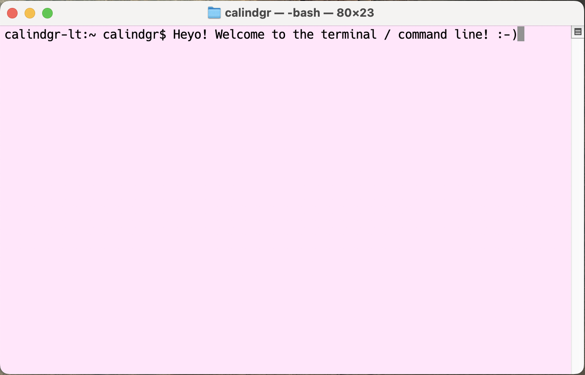

# 0.3-Using the Command Line

Before we begin learning about the JS programming language (PL), we need to learn about the command line. The command line — also referred to as *the shell*, *bash*, or *terminal* — is the gateway to computational analysis. Think of it like interacting with your computer behind the scenes.

Here are some of the important things that you can do from the command line:

* Run coded scripts in numerous PLs.
* Install software and PL packages.
* Work on different computers from your current computer, including work on cloud platforms such as Google Cloud or Amazon Web Services.
* Do basic text analysis.
* Do simple tasks, such as navigating your folders, renaming many files in batches, or resizing many images, allthewhile faster and more efficiently.
* Gain more power and flexibility over your computing experience!

**Note**: Technically speaking, *command line*, *shell*, *bash*, and *terminal* all mean slightly different things. The Digital Humanities Research Institute provides [a helpful primer on the distinctions](https://github.com/DHRI-Curriculum/glossary/blob/master/sections/command-line.md#glossary).

The command line interface is often contrasted with the graphical user interface or GUI (pronounced *gooey*, like [St. Louis gooey butter cake](https://en.wikipedia.org/wiki/Gooey_butter_cake)). This is the way that most people are familiar with navigating their computers.

To illustrate the difference between the command line and the GUI, consider the following example. I want to make a new folder to organize my notes for this class. So I drag my mouse cursor and click on a button that says "New Folder," which makes a small icon of a folder appear. I title this folder "test". Now I want to delete this folder. So I drag and drop the folder icon into a tiny trash can icon. This is the GUI in action. This is how we interact with our computers *graphically* — with visual icons, movements, and mouse clicks.

But that's not the only way we can interact with our computers. We can do all of the above from the command line as well. Instead of dragging and dropping little folder icons, we would type in textual commands, such as `mkdir test-1-2-3` (to make a folder or directory) and `rmdir test-1-2-3` (to remove the directory).

<video controls style="width: 620px; height:620px">
  <source src="../assets/vids/getting-started/03-cmd-line-primer.mp4" type="video/mp4" />
</video>

Making a folder from the command line as opposed to dragging and clicking with the mouse won't save us a ton of time. Maybe a couple of seconds at most.

But in the aggregate, with larger tasks, these seconds start to add up. Since we can automate tasks from the command line, we can transform things that would be tedious and time-consuming to do manually — such as resizing 1000 photos or combining a dozen smaller CSV files into one large file — into useful and efficient scripts.

That's just the tip of the iceberg. From the command line, you can also run Node.js code, Python code, install software, or connect to a remote server or [Raspberry Pi](https://www.raspberrypi.org/products/raspberry-pi-4-model-b/) (a cheap, tiny computer where you can make Twitter bots and more). The command line offers you greater power and flexibility over your computing experience.

## 0.3.1 Where do I find the command line?

Your command line will differ depending on the operating system (OS) that you're using. Most operating systems fall into two different families: the **Unix-like** family and the **Microsoft Windows** family. The Unix-like family includes Mac OS, Linux, Android, and Chrome.

We're going to focus on the command line interfaces for Mac, Microsoft Windows, and Chromebooks.

###  Mac OS

If you're using a Mac, access the command line through an application called "Terminal" by:

1. Searching for nder Applications -> Utilities.

When you open Terminal, you will see the name of your computer and your username followed by a dollar sign `$` or `%`. For example, when I go to the command line, I see the prompt `calindgr-lt:~ calindgr$`, as shown above. You type commands after the dollar sign `$`.

- **NOTE**: Your code begins after the dollar sign `$` or percentage sign `%` in all example code in this book or elsewhere—that symbol represents where you should start typing your own code. You do not need to include the symbol in your own code. It will cause an error. It's a common beginner's mistake to include the dollar sign `$` or another symbol, especially when consulting examples from the internet.

 ###  Windows OS

The command line for Windows users, called "Command Prompt," is different from the command line interface for Mac users and the wider Unix-like family. The Windows Command Prompt is not as powerful as the Unix shell in certain ways.

<b>Google Breakdown</b>

> See Google's breakdown of the best [Windows Command-line Tools](https://developers.google.com/web/shows/ttt/series-2/windows-commandline)

However, beginning with Windows 7, Microsoft also introduced "PowerShell," which acts like a more flexible and more powerful command line for Windows users. (You can read more about PowerShell in [Microsoft's official documentation](https://docs.microsoft.com/en-us/powershell/?view=powershell-6)).

<b>Aliases: An Example</b>

> For example, the PowerShell command that lists all the files and folders in a particular directory is `Get-ChildItem`. The traditional Windows Command Prompt command `dir` and the Unix command `ls` also work in PowerShell and perform the same function.

We're going to focus on PowerShell, as opposed to Command Prompt, for a number of reasons. One very convenient reason is that PowerShell commands have "aliases." They go by a number of different names, including names that are used by the traditional Windows Command Prompt and by a Mac Terminal.

These aliases will conveniently allow you to learn a little about Unix and Windows commands at the same time. Since we're mostly trying to understand how the command line functions at a broad level, this level of familiarity will suffice for now. In the future, you may want to invest more time in learning the specifics of PowerShell or the Command Prompt.

To open PowerShell, simply search for it in the Windows search bar, as shown above.

###  Chromebook

To access the command line from a Chromebook, you first need to turn on Linux (Beta). The following instructions are taken from [Google Chromebook Help](https://support.google.com/chromebook/answer/9145439?hl=en).

- At the bottom right, select the time
- Select Settings
- Under "Linux (Beta)," select Turn On
- Follow the steps on the screen. Setup can take 10 minutes or more
- A terminal window opens. You can run Linux commands, install more tools using the APT package manager, and customize your shell

## 0.3.2 Command Line Cheatsheet

| **Mac / Chrome / Linux**                            | **Explanation**                                                                                               | **Windows PowerShell**                                                                   |
|--------------------------------------------|-----------------------------------------------------------------------------------------------------------|--------------------------------------------------------------------------------------|
| `cd` *filepath*                            | **c**hange **d**irectory, aka move into a different folder                                                | `cd` *filepath*                                                                      |
| `ls`                                       | **l**i**s**t the files and folders in your current **dir**ectory                                          | `ls` / `dir` / `Get-ChildItem`                                                       |
| `pwd`                                      | show **p**ath of **w**orking **d**irectory, aka the folder that you're in right now                       | `pwd` / `cd`                                                                         |
| `touch` *filename*                         | make a new file                                                                                           | `ni` *filename*                                                                      |
| `mkdir` *directory-name*                   | **m**a**k**e a new **dir**ectory, aka a folder                                                            | `mkdir` *directory-name*                                                             |
| `rm` *filename*                            | **r**e**m**ove, aka delete, a file or directory                                                           | `rm` *filename* / `del` *filename*                                                   |
| `cp` *original-filename* *copied-filename* | **c**o**p**y a file or directory                                                                          | `cp` / `copy`                                                                        |
| `mv` *original-filename* *new-filename*    | **m**o**v**e or rename a file or directory                                                                | `move` *original-filename* *new-filename* / `ren` *original-filename* *new-filename* |
| `cat` *filename*                           | show all the contents of a file                                                                           | `cat` *filename* / `type` *filename*                                                 |
| `less` *filename*                          | show snippet of a file that allows you to scroll through the entire thing                                 | `more` *filename*                                                                    |
| `head` *filename*                          | show the first 10 lines of a file (change number of lines by adding `-*a number*` flag, e.g. `head -100`) | `gc` *filename* `-head 10`                                                           |
| `tail` *filename*                          | show the last 10 lines of a file (change number of lines by adding `-*a number*` flag, e.g. `tail -100`)  | `gc` *filename* `-tail 10`                                                           |
| `wc -w -l` *filename*                      | show how many **w**ords or lines in a file                                                                | `gc` *filename* \| `Measure-Object -Word –Line`                                      |
| `man` *command*                            | show the **man**ual, aka the documentation that tells you what a particular command does                  | `help` *command*                                                                               |
| `echo`                                     | print text to the command line                                                                            | `echo`                                                                               |
| `grep` "search term" *filename* or *directory-name*       |      search for lines that include search term in file                                                                                                     | `findstr` "search term" *filename*                                                                 |
| `curl -O` *url*            | **get**, a file from the **w**eb                                                                          | `wget` *url* `-OutFile` *new-filename*                                               |

## Submission

On Moodle, submit an image of a screenshot showing your command of the command line.

Make sure the screenshot shows how you demonstrate the following actions:

1. Change directories/folder to somewhere like `Documents` on your local computer.
2. Inside of this directory,
    1. Make a new directory/folder called `Command`.
    2. Change the directory into `Command`.
    3. Inside `Command`, make another new directory/folder called `Prompt`.
    4. Change the directory into `Prompt`
    5. Inside of `Prompt`, create a new file called `here.md`
3. In one change of directory, go back to the original folder like the example's `Documents`.
