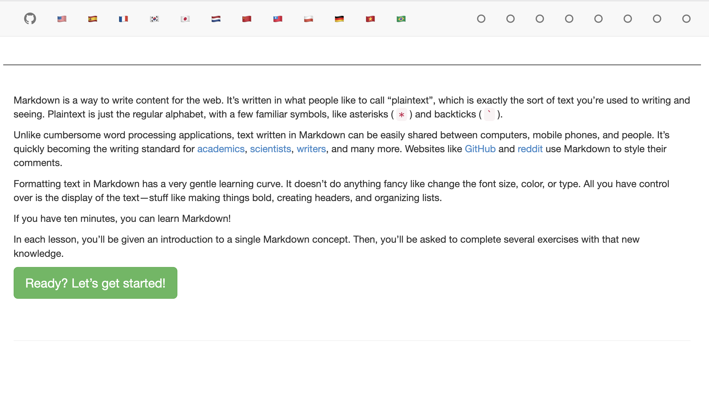

<style type="text/css">

  .focus {
    color: var(--theme-foreground-focus);
  }

  .invert {
    background-color: var(--theme-foreground-alt);
    color: var(--theme-background);
  }

  .crop {
    border-radius: 8px;
    margin: 1rem;
    max-width: calc(100% - 2rem);
    box-shadow: 0 0 0 0.75px rgba(128, 128, 128, 0.2), 0 6px 12px 6px rgba(0, 0, 0, 0.4);
    aspect-ratio: 3024 / 1888;
    object-fit: cover;
    object-position: 0 100%;
  }

  .wbr::before {
    content: "\200b";
  }

  .wide {
    max-width: 960px;
  }

  figcaption code {
    font-size: 90%; /* TODO move to global.css */
  }

</style>

# 0.2-Reading & Writing Code Files

In this chapter, we will practice configuring your VS Code editor, understanding the project architecture of this book's Observable data app, and learning how to read and write texts in the Markdown format.

Learning this Markdown format is essential, because it will help you develop your Observable Framework data apps, since your coding work will be interwoven with Markdown-flavored text.

## Start Your GH Workflow

Ok, you should first make sure to have **forked** ***AND*** **cloned** this [book's repository](https://github.com/ENG498-JCDD/Justice-Centered-Data-Design) to your personal GH account.

Then, we will practice always following this GH methodological workflow for most assignments:

1. For each chapter, ***before you start modifying any exercises***, create a new separate ***branch*** of work on the repo, so you isolate any new work on the repo to those specific set of files.
    <p class="note">
      Always create the new branch from the <strong>main</strong> branch, when starting a new chapter of work. By doing so, you avoid creating complex differences between files organized in the repo directories.
    </p>
2. Name the new branch with the following naming scheme: `CHP/x--name_of_chp`.
3. Complete the work in the chapter, committing and pushing work as needed.
4. When you are ready to submit your work for review, create a ***pull request*** (PR).
    <p class="note">
      Copy and paste the content from the `TEMPLATE-PR.md` file in the project's root folder.
    </p>
5. Solicit feedback from your assigned peers.
6. Make any changes, as needed, based on any feedback by committing pushing those changes to the branch.
7. Notify me, Dr. Lindgren, that you are ready for a grade.
8. When I tell you that your work is complete, ***merge*** the PR into the ***main*** branch.

## Overview

Let's cover some fundamentals before we venture any further. You must first learn how to read the different types of code files in the project *and* understand how the files are organized in what's called the ***architecture*** of the project. We will focus first on files written in what's called ***Markdown***.

## 0.2.1 Configure VS Code

Before we begin, let's make your reading, writing, and developing life a little easier with some VSC tools and settings.

### Default VSC settings

- **Indentation**: Change to 2 spaces.
  1. Open *Settings* and search for *detect indentation*.
  2. Ensure that *Detect indentation* is ***de***selected.
  3. In the top search bar, search for *tab size*.
  4. Under the *Tab Size* setting, change the value to **2**.
- **Word Wrap**: Switch to on setting.
  1. Open *Settings* and search for "*word wrap*".
  2. Under the *Word Wrap* dropdown menu, select ***on***.
- **Terminal**: For Mac OSX, switch to *bash*.
  1. Open Settings and search for "Terminal › Integrated › Default Profile: Osx".
  2. In the dropdown menu, select ***bash***.

## 0.2.2 Markdown: Take 10 Minutes to Learn It!

Markdown (MD) is one way to write and format content for the web, because it uses the most universal text encodings called ***plaintext***. Plaintext written in MD can be easily shared between computers, mobile phones, and people.

Formatting text in MD enables you to easily format content by making things bold, creating headers, and organizing lists. Websites like Reddit and Github, as well as writing tools like Obsidian, all use MD to style their comments. For example, here's how to use the asterisk in three different ways:

- One `*` for italics: I am *italicized*!
- Two `**` for bolded: I am **bolded**!
- Three `***` for bolded and italics: I am ***bolded and italicized***!

Learn more about MD at [Markdownguide.org](https://www.markdownguide.org/getting-started/), and save this [cheatsheet](https://www.markdownguide.org/cheat-sheet/) as a learning aid.

Before you go any further, complete the [Markdown Tutorial](https://www.markdowntutorial.com/).



<p class="note">You will need to submit a screenshot of the completion screen by rendering it on this page in one of the exercises below.</p>

## 0.2.3 Project Structure

Software projects require understanding its structure: Where, How, and Why files are organized and stored in a particular way. It isn't enough to save a file anywhere. Code requires specific pointers to load and use resources at well-defined locations. So, understanding project structure, i.e., architecture, is paramount!

For example, the Observable Framework folks designed typical Framework project architecture of their own, which I have taken and modified below for this course's textbook.

```bash
/
├─ /src
│  ├─ /00-Getting-Started
│  │  └─ 00-what-is-framework.md
│  │  └─ 01-git-github.md
│  │  └─ ...
│  ├─ /01-Learning-JS
│  │  ├─ /utils
│  │  │  └─ utils.js
│  │  └─ 00-why-stats.md
│  │  └─ 01-freq-dist.md
│  │  └─ ...
│  ├─ /02-Why-Stats
│  │  └─ 00-why-stats.md
│  │  └─ 01-freq-dist.md
│  │  └─ ...
│  ├─ /...
│  ├─ /assets
│  │  ├─ /css
│  │  ├─ /images
│  │  │  ├─ /1-js
│  │  │     └─ imagefile.png
│  │  │     └─ another.jpg
│  │  ├─ ...
│  ├─ /data
│  │  ├─ /...
│  │  ├─ /nc-voters
│  │  │  └─ ...
│  │  │  └─ nc_absentee_mail_groupedby_race_gender_2024.csv
│  │  │  └─ ...
│  │  ├─ /...
│  │  ├─ launches.csv.js       # Observable data loader
│  │  └─ events.json           # a static data file
│  └─ index.md                 # the home page
├─ .gitignore
├─ observablehq.config.js      # the Observable app config file
├─ package.json
└─ README.md
```

**/** - This forward-slash represents the "root” of the Observable app project. Everything related to this project and its development resides within the directory called "`Justice-Centered-Data-Design`".

**/src** - This is the “***source root***”. This folder contains all of the *source* files. We'll leanr how additional pages go here, and how each page is a Markdown file. Observable Framework uses [file-based routing](https://observablehq.com/framework/project-structure#routing), which means that the name of the file controls where the page is served.

**/src/index.md** - This is the home page for the Observable app. Observable enables you to add as many additional pages as you’d like, but you should always have a home page named `index.md` in your project in the root of the designated ***source root*** folder.

**/src/data** - You should put static data files in here, or something Observable calls [data loaders](https://observablehq.com/framework/data-loaders), which we may learn how to write later in the class. Data files can be located anywhere in your *source root*, but it is highly recommend organizing data in this folder.

**/src/assets** - You should organize assets, i.e. file resources in this folder. If you look closely, you'all see that this project has multiple subfolders in here, such as `images` or `vids`. We can neatly organize our assets, like media files, so we can them use them in the project later and find them easily with this dedicated space.

**/src/components** - Components are reusable code modules that we can use throughout the app. We'll learn more about them later. You can put shared [JavaScript modules](https://observablehq.com/framework/imports) anywhere in your source root, but you should definitely organize them in this folder.

**/observablehq.config.js** - This is the [app configuration](https://observablehq.com/framework/config) file, such as the pages and sections in the sidebar navigation, and the app’s title.

Overall, a project's structure helps you organize and stay organized, so you can create your own mind palace for each project for easier memory retention and recall. Believe me! As someone who has worked on multiple software projects, structure matters and helps reduce the workload, when executed well.

## 0.2.4 On Filepaths: Navigating Your Project's Structure

Ok, so project's maintain a well-defined architecture, so you can organize your files. Great! But, how do we use them?! ***Enter filepaths***.

All coding projects rely on the resources of numerous other code files. Your computer needs to know where those specific files are in relationship to any code file you're working on. So, it is imperative that you learn how to point to other files from within other files of a project, or even external to a project.

Filepaths are written in a syntax that follows a standard called a ***URL***: ***Uniform Resource Locator*** (see [Wikipedia entry](https://en.wikipedia.org/wiki/URL)). URLs are standardized (agreed upon) ways to write out a path to a resource on any computer. This simple standard enables others to develop programming languages that can assume a universal syntax to find all resources—even on computers somewhere across the planet!

Before we move forward, we need to know what notations to use in filepaths as declarations that tell computers what action to perform. The table below displays the most common three notations.

| Notation | Action |
|----------|--------|
| `/`  | **Two conditional meanings**:<br>&nbsp;&nbsp;1. **Start At Root**: If used as the first character in a path, declares you are starting at the root of a project.<br>&nbsp;&nbsp;2. **Go Forward**: Always declares the action to go forward into the next defined folder. |
| `./`  | **Start In Present Working Directory**: Used only at the very start of a filepath. Tells computer to start the path in the present working directory of the file in which the path is written. |
| `..`  | **Go Back In Working Directory**: Used only at the very start of a filepath. Tells computer to start the path in the present working directory of the file in which the path is written. |

Ok, now that we know what URL notations are, let's learn about 2 main types of filepaths and how to use them: ***absolute*** paths and ***relative*** paths.

### Absolute paths

Absolute paths include the complete path information from the root of the specific server/computer.

**Remote Absolute Path**: If an absolute path involves a resource on the *remote* internet, it uses HTTP/HTTPS internet protocol at the beginning. Then, based on the root folder, you move forward in the directory until you reach the dsired location/file.

Let's understand this via an example of a Wikimedia image described below.

<div class="example">
  <p>
    <strong>Remote Absolute Path</strong>:
    <br>This particular Wikimedia remote absolute path to an image file has four main parts:
    <br>
    <a href="https://upload.wikimedia.org/wikipedia/commons/4/4a/The_Bell_System_technical_journal_%281922%29_%2814569328258%29.jpg" target="_blanl" rel="noreferrer noopenner">https://upload.wikimedia.org/wikipedia/commons/4/4a/The_Bell_System_technical_journal_%281922%29_%2814569328258%29.jpg</a>
  </p>
  <ol>
    <li><code>https://</code> - Internet Protocol.
    <li><code>upload.wikimedia.org</code> - Home root directory.
    <li><code>/commons/4/4a/</code> - Travels from `root` > `commons` > `4` > `4a` directory.
    <li><code>The_Bell_System_technical_journal_%281922%29_%2814569328258%29.jpg</code> - Locates .jpg file in `4a`.
  </ol>
</div>

**Local Absolute Path**: Local absolute paths assume you are using a specific computer local to you. For example, your computer is your local computer.

Here's an example of an absoulte path of this chapter's Markdown file, `04-reading-files.md`, as it is located on my personal local computer.

<p class="example">
  <strong>Copy Local Absolute Path</strong>:
  <br>
  If you view VSC's Explorer tree of this project, **right-click** on this chapter's <code>04-reading-files.md.md</code> file, and select **Copy Path**, it copies the absolute local path. In my case, the path copied is
  <br><code>/Users/calindgr/Documents/NCSU/Courses/498-Justice-Centered-Data-Design/Justice-Centered-Data-Design/src/00-Getting-Started/04-reading-files.md</code>.
</p>

### Relative paths

Relative paths include the path information that assumes you are starting from the position of the current file in the context of your project's architecture.

<p class="example">
  <strong>Copy Local Relative Path</strong>:
  <br>
  If you view VSC's Explorer tree of this project, **right-click** on this chapter's <code>04-reading-files.md.md</code> file, and select **Copy Relative Path**, it copies the relative local path. In our case of this repo, the path copied is
  <br><code>src/00-Getting-Started/04-reading-files.md</code>.
</p>

### Demonstrating filepath writing in the terminal

In the video below, I demonstrate how to practice using the above syntax to write paths in your terminal.

<video onloadstart="this.playbackRate = 1.25;"
       controls
       style="width: 620px; height:620px">
  <source src="../assets/vids/getting-started/04-reading-filepath-practice.mp4" type="video/mp4" />
</video>

## E1. Verify Markdown Course completion

Create a Markdown image, e.g., ``, which renders a screenshot of you completing the Markdown course.

Put the screenshot image in the following path, which assumes we're in the root of this project: `/src/assets/images/yourfilehere.png`.

Use a relative filepath in the Markdown image to do so.

ADD_YOUR_IMG_HERE

## E2. Link to 0.3 Using the Command Line

Write a markdown link, e.g., [Rendered linked text](./path/to/file.md), with a relative path to the `03-cmd-line.md` file for the "0.3-Using the Command Line" chapter.

Write one that assumes the file is `.md`, and another that assumes it is an `.html` file.

- enter_md_link_here
- enter_html_link_here

## E3. Link to a resource in same project

Write a markdown link, e.g., [Rendered linked text](./path/to/file.md), with a ***relative path*** to the `gh-anatomy.png` image file in this project. Link the following text in the bulleted point below: "Github Anatomy image".

<p class="tip">You will need to use the double-dot <code>..</code> notation to travel back up the hierarchy in the project, since the image is not in the same folder/directory as this chapter's file.</p>

- Link to the Github Anatomy image.

## E4. Render an image

Write a markdown image, e.g., ``, which renders the following image located in this project: `hotel-bookings.webp`.

<p class="tip">You will need to use the double-dot <code>..</code> notation.</p>

ENTER_IMG_HERE

## Submission

1. Create a **PR** (**pull request**) and use the provided content in the template to start it.
2. Respond to your peers and comment on their work too.
    - Peers: Respond to any questions, concerns, or triumphs noted in their PR description.
3. Submit the PR link in Moodle, when you're ready.
    <p class="warning">Make sure that your repo is set to being Public.</p>
