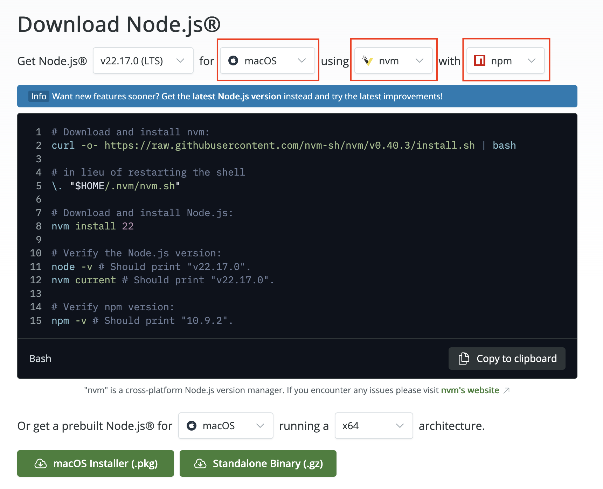
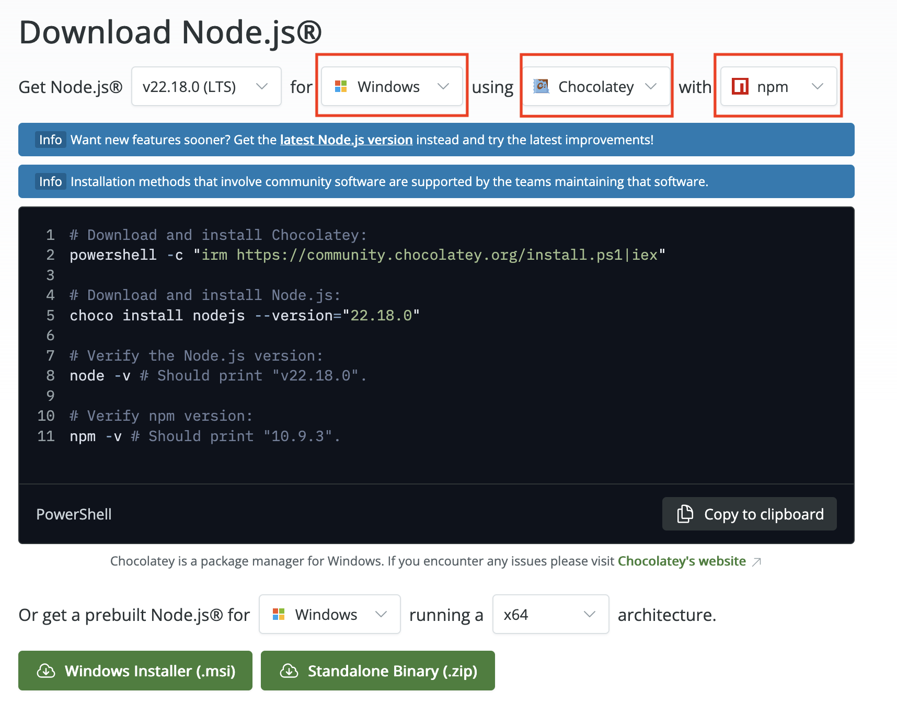

# Install Node, NPM, and Yarn

## Install Node.js

See Node.js directions on their website: [https://nodejs.org/en/download](https://nodejs.org/en/download). Use the settings in the commandline help, as seen per OS below.

### Mac Example

Make sure that you use their dropdown menus to select your operating system and `nvm` (Node Version Manager) and `npm` (Node Package Manager), as seen below.

Check what type of architecture your computer uses too!

Run these commands in Terminal.

### Windows Example

Make sure that you use their dropdown menus to select your operating system and `chocolately` (a Node version manager for Windows) and `npm` (Node Package Manager), as seen below.

Check what type of architecture your computer uses too!

Run these commands in CommandPrompt.

## Install Yarn Package Manager

In your terminal, do the following for both Mac and Windows OSes:

1. Download and install Yarn: `corepack enable yarn`
2. Verify Yarn version: `yarn -v`

## Submission

In Moodle, submit a screenshot image to Moodle, proving that you have installed Node.js and Yarn by printing our the version number in your terminal.
