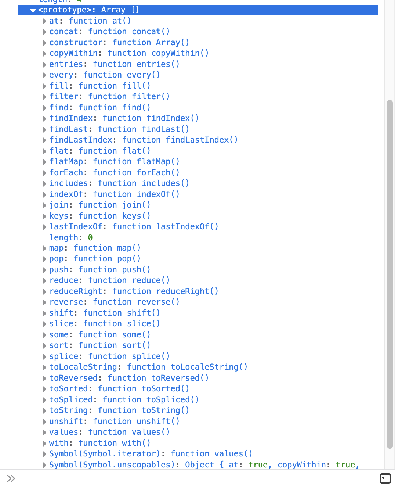
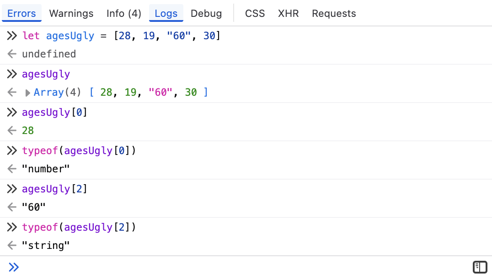
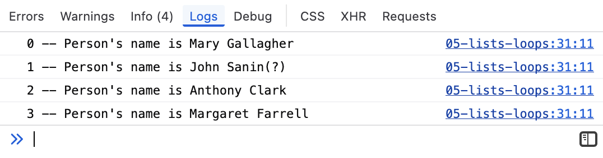
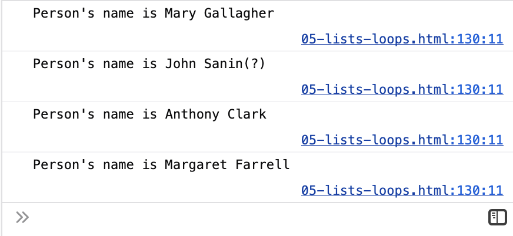
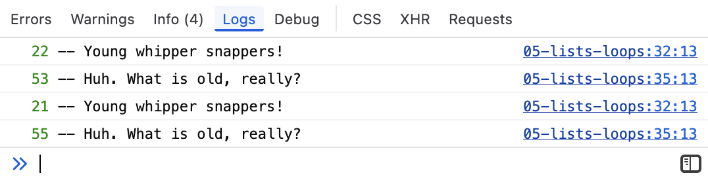

# 1.5 Lists (Arrays) and Loops

## Start Your GH Workflow

Remember, before you start anything else, always follow this GH methodological workflow:

1. Create meaningful **branch** that uses the agreed upon naming scheme: `CHP/X.x--lastname`.
2. Practice the iterative process to **commit** and **push** regularly with meaningful **commit messages**.

## Overview

In the previous lesson, we used individual variables to represent some of the demographic information about the 19th century Irish immigrants featured in the [Bellevue Almshouse data](https://gih-nyc.org/almshouse/the-almshouse-records/), such as names.

```javascript
let person1Name = 'Marry Gallagher'
let person2Name = 'John Sanin'
```

It's typically more useful, however, to create a *collection* of values rather than individual variables.

One of the most common data collections in JS is an `Array []`, i.e., *list*. By using an array, we can put the names of the people featured in the dataset into a single collection.

A list is always enclosed by square brackets `[]` and accepts items in a row separated by commas (`,`).

```javascript
let names = ['Mary Gallagher', 'John Sanin', 'Anthony Clark', 'Margaret Farrell']
```

```js
let names = ['Mary Gallagher', 'John Sanin', 'Anthony Clark', 'Margaret Farrell']
```

Let's check out the data type of `Array`.

<p class="codeblock-caption">
  Interactive output of array <code>names</code>
</p>

```js
names
```

Notice some of the features about the `Array` data type that you can review in the console:

- Defines the position of each value in the list: 0-3.
- Length of the array, i.e., the number of items in the list: 4.
- If you click on `<prototype>`, you can see a list of prototype methods that you can call on any Array in JS, such as `push`, `sort`, etc.:
    - 

An array list can contain any combination of JS data types.

<!-- Rendered javascript codeblock -->
```javascript
let ages = [28, 19, 60, 30]

// While not a good practice to mix data types,
// here's an example where "60" is not a Number, but a String.
let agesUgly = [28, 19, "60", 30]
```

<!-- Executable js codeblock -->
```js
let ages = [28, 19, 60, 30]
let agesUgly = [28, 19, "60", 30]
```

<p class="codeblock-caption">
  Interactive output of array <code>ages</code>
</p>

```js
ages
```

<p class="codeblock-caption">
  Interactive output of array <code>agesUgly</code>
</p>

```js
agesUgly
```

## 1.5.1 Array List Index

You can index a list like you would index a string.

For example, if we wanted to pull out the first item in our `names` list, we could put square brackets and our desired index number immediately after the list. Just like with strings, the JS index begins with 0.

Try it out in the console with the `ages` Array.

```javascript
ages[0] // 28
ages[2] // 60
```

Now, tinker around with the `agesUgly` array and see how there is indeed different data types.



## 1.5.2 Array List Methods

Array lists in JS also have a number of special methods that can be used with them. We will cover a few of the following:

- `.length` - How many items?
- `.slice()` - Cut up the items.
- `.reverse()` - Reverse the items.
- `.push()` - Insert item to end.
- `.splice()` - Insert item at specific index position.
- `.concat()` - Extend one Array by adding another at its end.
- `.map()` - Creates a new array populated with the results of calling a provided function on every element in the calling array.
- Refer to MDN's JS Reference: "[Array methods and empty slots](https://developer.mozilla.org/en-US/docs/Web/JavaScript/Reference/Global_Objects/Array#array_methods_and_empty_slots)" for a more comprehensive review of Array list methods.

### `.length()` - Get total number of items in array

You can easily retrieve the length of a array list with the `.length` method.

```javascript
let moreNames = [
  'Unity', 'Catherine', 'Thomas', 'William', 'Patrick',
  'Mary Anne', 'Morris', 'Michael', 'Ellen', 'James'
]

moreNames.length // 10
```

```js
let moreNames = [
  'Unity', 'Catherine', 'Thomas', 'William', 'Patrick',
  'Mary Anne', 'Morris', 'Michael', 'Ellen', 'James'
]
```

<p class="codeblock-caption">
  Interactive output of array <code>moreNames</code>
</p>

```js
moreNames
```

### `.slice()` - Insert item at specific position in array

You can also slice arrays like you can slice a string by using the `.slice()` method. It takes two parameters:

1. Starting index position
2. Cutoff index position. It will not include the item in this numbered position, but the item before it.

| Slice | Explanation | Output  |
|-------|-------------|---------|
| `moreNames.slice(0,2)`  | Slice list up to 2nd item | `['Unity', 'Catherine']`|
| `moreNames.slice(2,)`  | Slice from 2nd item to end of list  | `['Thomas', 'William', 'Patrick', 'Mary Anne', 'Morris', 'Michael', 'Ellen', 'James']`  |
| `moreNames.slice(2,5)` | Slice from 2 up until 5th item  | `[ "Thomas", "William", "Patrick" ]` |


Let's perform an example from the table.

```javascript
let moreNamesSliced = moreNames.slice(2,5)
```

<p class="codeblock-caption">
  Interactive output of sliced array <code>moreNamesSliced</code>
</p>

```js
let moreNamesSliced = moreNames.slice(2,5)
```

```js
moreNamesSliced
```

### `.reverse()` - Reverse the order of array contents

The `.reverse()` method does just that: reverses the order of all items.

```javascript
let moreNamesReversed = moreNames.reverse()
// moreNamesReversed: [ "James", "Ellen", "Michael", "Morris", "Mary Anne", "Patrick", "William", "Thomas", "Catherine", "Unity" ]
```

### `.push()` - Add new items to array

If you need to add another item to the array list, use `.push()`. The item will be appended to the end of the array.

```javascript
// ages before .push: [28, 19, 60, 30]
ages.push(44)
// ages after .push: [28, 19, 60, 30, 44]
```

### `.splice()` - Alter array contents in-place

The .splice() method changes the contents of an array by removing or replacing existing elements and/or adding new elements in place.

The method accepts the following parameters: `arrayListName.splice(start, deleteCount, item1, item2, /* …, */ itemN)`

```javascript
let someAges = [22, 53, 21, 55]
someAges.splice(1, 0, 33, 44)
// Result: [22, 33, 44, 53, 21, 55]
```

```js
let someAges = [22, 53, 21, 55]
someAges.splice(1, 0, 33, 44)
// Result: [22, 33, 44, 53, 21, 55]
```

<p class="codeblock-caption">
  Interactive output of spliced array <code>someAges</code>
</p>

```js
someAges
```

### `.concat()` - Extend array lists

Merge two or more arrays with the `.concat()` method. This method does not change the existing arrays, but instead returns a new array.

```javascript
let moreAges = [22, 53, 21, 55]
let evenMoreAges = [1, 2, 3, 4]
let concatAges = moreAges.concat(evenMoreAges)
// Result: concatAges == [22, 53, 21, 55, 1, 2, 3, 4]
```

```js
let moreAges = [22, 53, 21, 55]
let evenMoreAges = [1, 2, 3, 4]
let concatAges = moreAges.concat(evenMoreAges)
```

<p class="codeblock-caption">
  Interactive output of concatenated array <code>concatAges</code>
</p>

```js
concatAges
```

### `.map()` - Alter values in array and create new array

Sometimes we will need to create a new array of values based on an existing array. Enter `.map()`!

The `.map()` method loops through each item in the array and returns a value that you perform a function on. Again, `.map()` returns a new array.

Since `.map()` is our first more complex method, be sure to watch this video of me explaining what happens in the below example codeblock.

<video controls style="width: 620px; height:620px">
  <source src="../assets/vids/01-js/01-js-map.mp4" type="video/mp4" />
</video>

```javascript
let tempFarenheit = [92, 88, 85, 55]
// °F to °C Formula: Celsius = (Fahrenheit - 32) / 1.8
let tempCelsius = tempFarenheit.map(
  /**
   * @param: Function that loops through
   *         each item in array.
   *
   * @return: New value generated by
   *          the function.
   */
  (t) => (t - 32) / 1.8
)
```

```js
let tempFarenheit = [92, 88, 85, 55]
// °F to °C Formula: Celsius = (Fahrenheit - 32) / 1.8
let tempCelsius = tempFarenheit.map( (t) => (t - 32) / 1.8 )
```

<p class="codeblock-caption">
  Interactive output of new array <code>tempCelsius</code>
</p>

```js
tempCelsius
```

## 1.5.3 For Loops

One of the best ways to work with a list is with `for` loops. This is a way of considering each item in the list or "iterating" through the list.

In JS, there are multiple FOR looping methods. For now, we'll focus on `for () {}`. This for looping approach uses the parantheses to create a variable name that operates like a key, but it really just becomes the index position.

### `for...in` loops

```javascript
let namesIn = ['Mary Gallagher', 'John Sanin(?)', 'Anthony Clark', 'Margaret Farrell']

for (const name in namesIn) {
  // Note how name is assigned item's INDEX from array
  console.log(
    name,
    "--",
    "Person's name is", namesIn[name]
  )
}
```

<p class="codeblock-caption cc-image">
  Console logs from <code>for...in</code> loop:
</p>



### `for...of` loops

The `for...of` conditional statement is very similar to `for...in`. In the `for...of` expression, the per item assignment simply is the item in the array, rather than the index Number.

With `for...of`, we do not need to use the index accessor statement.

```javascript
let namesOf = ['Mary Gallagher', 'John Sanin(?)', 'Anthony Clark', 'Margaret Farrell']

for (const name of namesOf) {
  // Note how name is assigned actual item from array
  console.log("Person's name is", name)
}
```

<p class="codeblock-caption cc-image">
  Console logs from <code>for...in</code> loop:
</p>



## 1.5.4 For Loops with Conditions

Now you can combine for loops and conditionals to create more dynamic results.

Let's log any ages less than 30.

```javascript
let ages = [22, 53, 21, 55]

for (const a in ages) {
  if (ages[a] < 30) {
    console.log(ages[a], "-- Young whipper snappers!")
  }
  else {
    console.log(ages[a], "-- Huh. What is old, really?")
  }
}
```

Output:


## Exercises with Lists &amp; Loops

In the exercises below, you will practice writing for loops with conditional statements. I have also included one exercise with `map()`.

You have the choice about which for loop to use: `for...in` vs. `for...of`. You will find that sometimes, it may be helpful to use one over the other. Indeed, sometimes it may be better to have the index position from `for...in`, while other situations may simply just call for the actual item value provided by `for...of`. You decide!

Let's use the following array lists for these exercises.

```javascript
let professions = ["married", "laborer", "widow", "laborer", ]
let childStatus = ["Child Alana 10 days", "Catherine 2 mos", "", "Charles Riley afed 10 days" ]
let sex = ["f", "m", "f", "m", "i"]
```

<ul class="note">
  <li>In your code editor, note how I have provided an executable codeblock for you with <code>js</code>.
  <li>Be sure to convert all <code>javascript</code> codeblocks to executable blocks with the <code>js</code> notation.
</ul>

```js
let professions = ["married", "laborer", "widow", "laborer", ]
let childStatus = ["Child Alana 10 days", "Catherine 2 mos", "", "Charles Riley afed 10 days", "" ]
let sex = ["f", "m", "f", "m", "i"]
```

### E1. Removing an item from an Array

**Goal**: Use a `for...in` loop and a conditional statement to create a new array `lessProfessions` that does not have the second item, `"laborer"` in the list `professions`.

**Remember that the index begins with 0!**.

<p class="codeblock-caption">
  Interactive output of the array of <code>professions</code>
</p>

```js
professions
```

For this first exercise, I'll provide you with the basic structure:

```javascript
// Declare new and freshly empty array in which to push new items
let lessProfessions = ["married", "laborer", "widow", "laborer"]
for (const job in lessProfessions) {
  if (lessProfessions.length > 3) {
    lessProfessions.splice(1,1)
  }
}
```
```js
let lessProfessions = ["married", "laborer", "widow", "laborer"]
for (const job in lessProfessions) {
  if (lessProfessions.length > 3) {
    if (lessProfessions[job] == "laborer") {
      lessProfessions.splice(job,1)
    }
  }
}
```

<p class="codeblock-caption">
  Interactive output of the array of <code>lessProfessions</code>
</p>

```js
// Convert me to output `lessProfessions`
lessProfessions
```

### E2. Push/add a new profession to an array

**Goal**: Add a new profession as a String, `"spinster"`, to your `professions` list, then log it to the web console.

```js
lessProfessions.push("spinster")
// Convert and code here
```

<p class="codeblock-caption">
  Interactive output of the array of <code>lessProfessions</code>
</p>

```js
// Convert me to output `professions`
lessProfessions
```

### E3. Loop through an array and log to the console

**Goal**: Make a `for` loop that considers each item in the `professions` array and logs "Person's profession is ___", which "___" should be the profession from the array.

```js
for (const job of professions){
  console.log("Person's profession is", job)
}
```

### E4. More conditional pushing with `for...of`

**Goal**: Create a new array and populate, i.e., push all items from the `childStatus` array, except for any empty Strings. Use a `for...of` loop to do so.

```js
let newKids = []
for (const status of childStatus) {
  if (status != ""){
    newKids.push(status)
  }
}
```
```js
newKids
```

### E5. Conditional logging

**Goal**: Make a `for` loop that considers each item in the `childStatus` list. Log `"Person has child"` ***if*** the person has a child ***and*** `"Person does not have child"` ***if not***. Use `.length` in your conditional statement to enact this logging.

```js
for (const status of childStatus)
  if (status.length > 1){
    console.log("Person has child")
  }
  else {
    console.log("Person does not have child")
  }
  console.log(childStatus)
```

Make sure you check to see if the correct language has been logged to the web console.

### E6. Push a new item

**Goal**: Add a new String to the list `sex` called `"unknown"`. Output it to the page.

For your reference, here's the original declaration and instantiation of `sex`: `let sex = ["f", "m", "f", "m", "i"]`.

```js
sex.push("unknown")
```

```js
// Convert and output here
sex
```

### E7. More looping and conditional practice

**Goal**: Make a `for` loop that considers each item in the `sex` list. Log "Person is male" ***if*** the person is `"m"`, "Person is female" ***if*** the person is `"f"`, "Person is intersex" ***if*** the person is `"i"`, and "Person's sex is not known" ***if*** `"unknown"`.

```js
for (const birthSex of sex)
  if (birthSex == "f"){
    console.log("Person is female")
  }
  else if (birthSex == "m"){
    console.log("Person is male")
  }
  else if (birthSex == "i"){
    console.log("Person is intersex")
  }
  else if (birthSex == "unknown"){
    console.log("Person's sex is not known")
  }
```

Make sure to check if the items are logged correctly.

### E8. Using `.map()` with conditions

**Goal**: From the array `sex`, use `.map()` to create a new array called `sexFullTerm`, wherein each item pushed to the new array uses the full term. Specifically, each instance of `"f"` becomes `"female"`, each `"m"` becomes `"male"`, and each `"i"` becomes `"intersex"`.

Since this is your first big use of `.map()`, I'll give you the skeleton of the expression:

```js
// Skeleton of .map()
let sexFullTerm = sex.map(
  (sexItem) => {
    if (sexItem == "f"){
      return "female"
    }
    else if (sexItem == "m"){
      return "male"
    }
    else if (sexItem == "i"){
      return "intersex"
    }
    else {
      return "unknown"
    }
    // Enter your code in here,
    // which will include conditional statements.
    // Also, be sure to use `return` statements
    // where appropriate!
  }
)
```
```js
sexFullTerm
```

## Submission

1. Create a **PR** (**pull request**) and use the provided content in the template to start it.
2. Respond to your peers and comment on their work on at least one chapter..
3. Submit the PR link in Moodle, when you're ready.