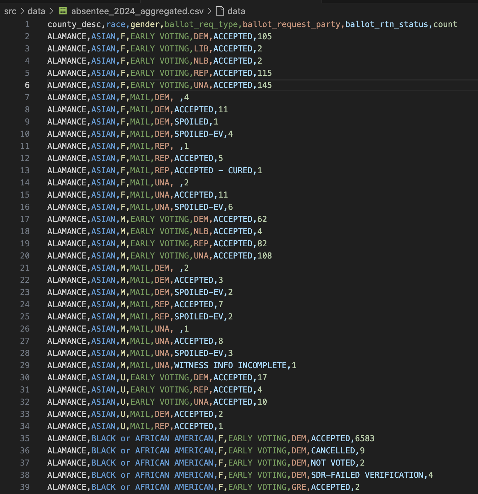

# 1.8. Data Formats & Loading

<p class="cite_small">
  Some content below is reused and modified from Observable Framework's documentation page about the <a href="https://observablehq.com/framework/files" target="_blank" rel="noopenner noreferrer">FileAttachment()</a> function</a>.
</p>

## Start Your GH Workflow

Remember, before you start anything else, always follow this GH methodological workflow:

1. Create meaningful **branch** that uses the agreed upon naming scheme: `CHP/X.x--lastname`.
2. Practice the iterative process to **commit** and **push** regularly with meaningful **commit messages**.

## Overview

Thus far, we've been working with data declared and instantiated within the notebook itself. Yet, often is the case that we will be working with data sets that we save and load from the `data` folder.

Let's learn how about common standard data formats, as well as how to load these files, so we can use a variety of data sets.

## 1.8.1 Common Data File Formats: CSV & JSON

Data are texts with a repeatable pattern in structure. We are going to learn about two main types of data file formats, which we will use throughout this course: CSV & JSON.

### CSV - Comma Separated Values

CSV stands for Comma Separated Values. The CSV standard assumes the following structure and patterns to create 2-dimensional data with rows and columns like spreadsheet tables:

- Every line == 1 row.
- Commas separate values, thereby making columns.
- First line is reserved for the header, i.e., the column names.

Here's an example demonstrating these basic rules:

```
col1,col2,col3,col4
value_col1,value_col2,value_col3
value_col1,value_col2,value_col3
value_col1,value_col2,value_col3
value_col1,value_col2,value_col3
```

Here's another example with highlighted text from the 2024 NC voter data set included in this project (See `/src/data/nc-voters/absentee_2024_aggregated.csv`):



### JSON: JavaScript Object Notation

According to the [standards body for the JavaScript Object Notation](https://www.json.org/json-en.html) (JSON), this data format is a "collection of name/value pairs" that is "... is easy for humans to read and write ... [and] for machines to parse and generate."

In this project, check out the `/src/data/events.json` file, which is a small example of a JSON file. Note how it is an Array list `[...]` that contains a collection of Objects `{...}` separated by commas `,`.

```json
[
  {"name": "Sputnik 1", "year": 1957, "y": 10},
  {"name": "Apollo 11", "year": 1969, "y": 20},
  {"name": "Viking 1 and 2", "year": 1975, "y": 30},
  {"name": "Space Shuttle Columbia", "year": 1981, "y": 40},
  {"name": "Hubble Space Telescope", "year": 1990, "y": 50},
  {"name": "ISS Construction", "year": 1998, "y": 60}
]
```

<p class="question">
  What other properties of JSON do you notice?
</p>

**RESPONSE**: I notice that each object contains multiple "variables". These variables are strings and separate by a `:` i.e., `"variable name": "specific data point"`. Rather than having heading at the top like a CSV, the headings are mixed into the data.

## 1.8.2 Framework's FileAttachment()

Ok, so how do you work with datasets in CSV or JSON? The most convenient method provided by Observable Framework is their `FileAttachment()` function.

Framework's `FileAttachment()` function takes one parameter, which is a String literal. It uses as a local path to locate the desired file to attach to the page. The path parameter is relative to the calling code’s source file, e.g., the page’s Markdown file.

Here's the syntax:

```javascript
const data = FileAttachment("./../relative/path/to/data.csv")
```

If loaded successfully, the following properties of the variable are available in addition to the data:

- `name` - the file’s name (such as `data.csv`)
- `mimeType` - MIME type (such as text/csv),
- `lastModified` - modification time (in milliseconds since epoch), and
- `size` - size in bytes.

```javascript
// Example use and accessing of FileAttachment properties
data.name // == data.csv
data.mimeType // == text/csv
```

### FileAttachment file methods

Here's an important detail. The `FileAttachment()` function doesn’t actually load the file for you to use all by itself!

Before you can do anything, Framework is designed to apply a file-format method. Once this method is applied, the file is officially loaded.

Use the appropriate method for the file type. For instance, a CSV file means that you should use the `.csv()` method.

<div class="example">
  <p>
    <code>const data = FileAttachment("./../relative/path/to/data.csv").csv({typed: true})</code>
  </p>
  <p>
    See Observable's documentation about the <a href="https://observablehq.com/framework/lib/csv" target="_blank" rel="noopenner noreferrer">.csv()</a> method.
  </p>
</div>

A quick note about the .csv() method. Note how CSV assumes the values are delimited, i.e., separated, by commas. Some files use different delimiters, such as semicolons. For a different delimiter, like semicolon separated values, use the `.dsv()` method and pass the delimiter as a parameter called `delimiter`:

```javascript
// Revised the typical one-liner just for the sake of formatting
const capitals = FileAttachment("us-state-capitals.csv").dsv(
  {
    delimiter: ";",
    typed: true
  }
)
```

#### File methods & supported file formats

In the table below, review what file formats are currently supported and what data type the method returns. We will typically be using `.csv()` and `.json()`, and occassionally `.txt()` for text files and `.xlsx()` for MS Excel files.

<!-- FileAttachment() Supported Filetypes -->
<table>
  <thead>
    <tr>
      <th>method</th>
      <th>return type</th>
    </tr>
  </thead>
  <tbody>
    <tr>
    <td><code>file.arquero</code></td>
    <td>Arquero <code>Table</code></td>
    </tr>
    <tr>
    <td><code>file.arrayBuffer</code></td>
    <td><code>ArrayBuffer</code></td>
    </tr>
    <tr>
    <td><code>file.arrow</code></td>
    <td>Arrow <code>Table</code></td>
    </tr>
    <tr>
    <td><a href="#binary-formats"><code>file.blob</code></td>
    <td><code>Blob</code></td>
    </tr>
    <tr>
    <td><code>file.csv</code></td>
    <td><code>Array</code> of objects</td>
    </tr>
    <tr>
    <td><code>file.dsv</code></td>
    <td><code>Array</code> of objects</td>
    </tr>
    <tr>
    <td><code>file.html</code></td>
    <td><code>Document</code></td>
    </tr>
    <tr>
    <td><code>file.image</code></td>
    <td><code>HTMLImageElement</code></td>
    </tr>
    <tr>
    <td><code>file.json</code></td>
    <td><code>Array</code> of objects, <code>Object</code>, <em>etc.</em></td>
    </tr>
    <tr>
    <td><code>file.parquet</code></td>
    <td>Arrow <code>Table</code></td>
    </tr>
    <tr>
    <td><code>file.sqlite</code></td>
    <td><code>SQLiteDatabaseClient</code></td>
    </tr>
    <tr>
    <td><code>file.stream</code></td>
    <td><code>ReadableStream</code></td>
    </tr>
    <tr>
    <td><code>file.text</code></td>
    <td><code>string</code></td>
    </tr>
    <tr>
    <td><code>file.tsv</code></td>
    <td><code>Array</code> of objects</td>
    </tr>
    <tr>
    <td><code>file.xlsx</code></td>
    <td><code>Workbook</code></td>
    </tr>
    <tr>
    <td><code>file.xml</code></td>
    <td><code>Document</code></td>
    </tr>
    <tr>
    <td><code>file.zip</code></td>
    <td><code>ZipArchive</code></td>
    </tr>
  </tbody>
</table>

## 1.8.3 Framework's Data Loaders

Observable Framework also provides us with the ability to preload and preprocess larger data sets with data loaders.

Data loaders helps us widdle larger data sets down to smaller sizes before the page loads on the user (client) side for better performance and easier comprehension. However, we can't really learn how to use them quite yet, since it involves coding with the data and data formats. So, for now, just know that we will learn about this option later.

If you wish to read about them, see Observable Framework's "[Data loaders](https://observablehq.com/framework/data-loaders)" page.

## Exercises

### E1. Understanding CSV file formats

Goal: Demonstrate your understanding of the CSV file format by creating a mini CSV file with **3 columns and 5 rows with the topic of your choice**.

Use the empty codeblock below.

```
```

### E2. Load a CSV file

**Goal**: Load a data file and demonstrate your ability to access its properties and data values.

In this case, load the following CSV file: `nc_absentee_mail_2024.csv`.

1. In the first codeblock, attach the `.csv` file and assign it to a meaningful variable name.
    <p class="tip">You're going to need to write a relative path here!</p>
2. In the second codeblock, use `console.log()` to log the following properties to the console: `.name` and `.size`.
3. Still in the second codeblock, add a second `console.log()` and log the first object in the Array to the console.

```javascript
// Your FileAttachment() code goes here
```

```javascript
// Your other code with your variable goes here
```

Make sure that you verify the logs are there!

## Submission

1. Create a **PR** (**pull request**) and use the provided content in the template to start it.
2. Respond to your peers and comment on their work on at least one chapter..
3. Submit the PR link in Moodle, when you're ready.
