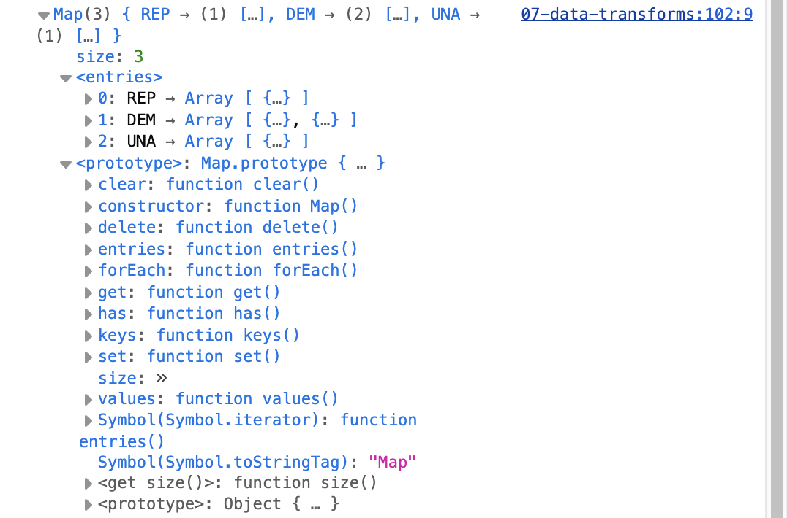
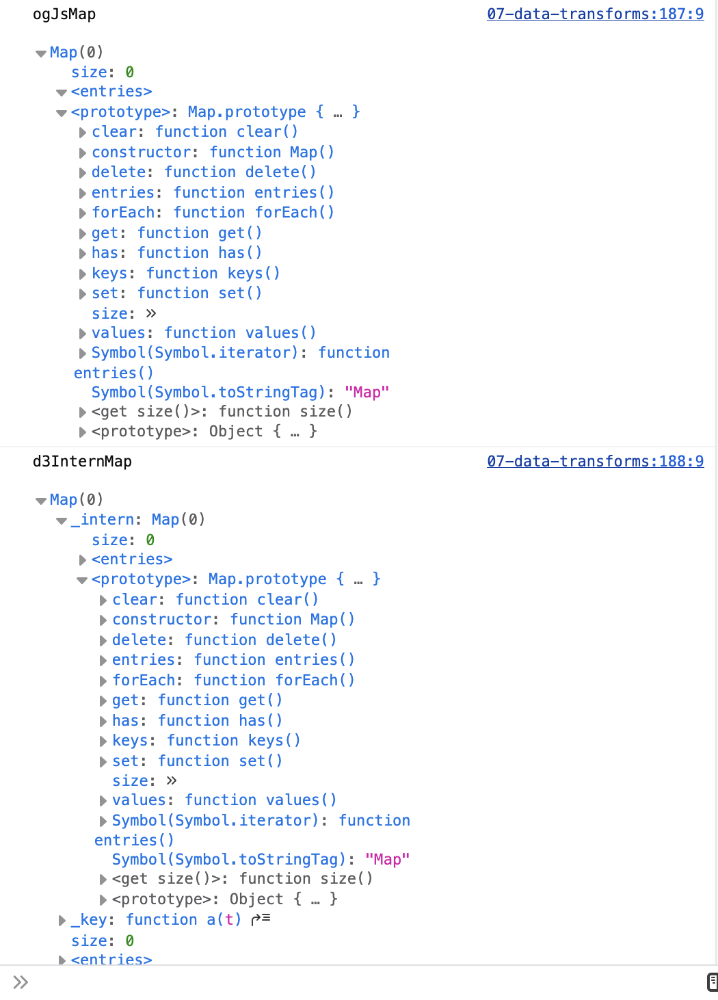

# 1.9 Objects & Maps

In the previous lessons, we used individual variables to represent some of the demographic information about the 19th century Irish immigrants featured in the [Bellevue Almshouse data](https://gih-nyc.org/almshouse/the-almshouse-records/), such as names.

```javascript
let person1Name = 'Marry Gallagher'
let person2Name = 'John Sanin'
```

We learned that Array lists help us create a *collection* of values rather than individual variables.

```javascript
let names = ['Mary Gallagher', 'John Sanin', 'Anthony Clark', 'Margaret Farrell']
```

Yet, if all of this data are meaningful together, we should use data types that helps us self-document our data. By self-document, I mean that the each ***value*** in the data should be labeled as a means for readers to understand what the values mean.

Let's take some time to learn a few common JS data structures that help us work with datasets.

## 1.9.1 JS Objects & Array of Objects

Ok, so we learned a little about the CSV and JSON data-interchange formats—formats that people can use across nation-states and expect them to work well.

Now, let's learn about some JS-specific data types that you will use frequently. Similar to JSON, the JS language uses Objects to create a collection of multiple types of name/value pairs. Objects  are scoped with opening and closing curly braces, `{ }`, where in-between them we add our key/value pairs, each of which we demarcate with a comma: `{ key: value, key: value, key: value, }`.

<p class="note">Unlike JSON, JS object array keys need not be wrapped in double-quotes.</p>

A common structure used to create a collection of JS Objects is to push them into an Array `[]`. Indeed, recall how when you load data with Observable Framework's `FileAttachment` function, it will automatically convert it into an Array of Objects:

```javascript
[
  {uniqKey: value, ...},
  {uniqKey: value, ...},
  {uniqKey: value, ...},
  ...
]
```

Creating an Array of JS Objects is very helpful with more complex data, because of the self-documenting feature, as well as the ability to create more meaningful relationships between parts of the data via nested hierarchies.

For example, here's a sample of NC 2024 voter data. Note how there seems to be two main parts to the available date: *voter demographics* and *ballot information*.

<!-- Render nc2024SampleVoters -->
```javascript
// Sample of 4 randomly selected abridged entries from NC November 2024 absentee voter data
let nc2024SampleVoters = [
  {
    "race": "WHITE",
    "ethnicity": "NOT HISPANIC or NOT LATINO",
    "gender": "F",
    "age": 33,
    "ballot_req_type": "MAIL",
    "ballot_request_party": "REP",
    "ballot_req_dt": "10/23/2024",
    "ballot_send_dt": "10/28/2024",
    "ballot_rtn_dt": null,
    "ballot_rtn_status": null
  },
  {
    "race": "BLACK or AFRICAN AMERICAN",
    "ethnicity": "UNDESIGNATED",
    "gender": "F",
    "age": 57,
    "ballot_req_type": "MAIL",
    "ballot_request_party": "DEM",
    "ballot_req_dt": "09/14/2024",
    "ballot_send_dt": "09/23/2024",
    "ballot_rtn_dt": "10/28/2024",
    "ballot_rtn_status": "SPOILED-EV"
  },
  {
    "race": "WHITE",
    "ethnicity": "NOT HISPANIC or NOT LATINO",
    "gender": "M",
    "age": 21,
    "ballot_req_type": "MAIL",
    "ballot_request_party": "UNA",
    "ballot_req_dt": "09/19/2024",
    "ballot_send_dt": "09/21/2024",
    "ballot_rtn_dt": "10/24/2024",
    "ballot_rtn_status": "ACCEPTED"
  },
  {
    "race": "WHITE",
    "ethnicity": "UNDESIGNATED",
    "gender": "F",
    "age": 32,
    "ballot_req_type": "MAIL",
    "ballot_request_party": "DEM",
    "ballot_req_dt": "08/03/2024",
    "ballot_send_dt": "09/24/2024",
    "ballot_rtn_dt": null,
    "ballot_rtn_status": "SPOILED-EV"
  }
]
```

Arrays of JS objects, like JSON, offer us lots of flexibility and creativity when structuring our data. For example, note how each voter object includes two types of information: demographics and ballot information. So, another approach to the structure could group the voter data by voter demographics and ballot information in a nested hierarchy: `{ "key": {...}, "key": {...} }`.

<!-- Render nc2024PerVoterAndBallot -->
```javascript
// Sample of 4 randomly selected abridged entries from NC November 2024 absentee voter data
let nc2024PerVoterAndBallot = [
  {
    "voter": {
      "race": "WHITE",
      "ethnicity": "NOT HISPANIC or NOT LATINO",
      "gender": "F",
      "age": 33,
    },
    "ballot_info": {
      "req_type": "MAIL",
      "request_party": "REP",
      "req_dt": "10/23/2024",
      "send_dt": "10/28/2024",
      "rtn_dt": null,
      "rtn_status": null
    }
  },
]
```

## 1.9.2 The Ubiquitous Data Problem: Processing It

Here's the rub. Because datasets are complex and often designed with situated goals in mind of their creators, datasets rarely come in the exact structure that we may need for our goals and needs. Indeed, According to a survey of over 16,000 data-science practitioners ([Kaggle, 2017](https://web.archive.org/web/20181130112939/https://www.kaggle.com/surveys/2017)), data processing is the most common barrier that they face at work before their desired analysis.

Due to this unavoidable situation, data work often requires processing work. In fact, it's normally the most time-consuming part of any data-driven project. Processing is a catch-all term that typically refers to any actions that take data in its original provenance and dis-aggregated form and change any structure and/or values, as desired, by the new persons in new contexts and situations.

<div class="note--suggested-reading">
  <p>
    Read the below articles to learn more about how much interpretation and deliberation work goes into data processing work.
  </p>
  <ul>
    <li>Lindgren, Chris. (2024). A stasis network methodology to reckon with the rhetorical process of data: How a data team qualified meaning and practices. <cite>Technical Communication Quarterly</cite>, 33(4), 475-500. doi: <a href="https://doi.org/10.1080/10572252.2024.2306259">10.1080/10572252.2024.2306259</a>
    <li>Lindgren, Chris. (2021). Writing with data: A study of coding on a data-journalism team. <cite>Written Communication</cite>, 38(1), 114-162. doi: <a href="https://doi.org/10.1177/0741088320968061">10.1177/0741088320968061</a>.
  </ul>
</div>

## 1.9.3 Why Create Maps & Groups?

In JS, an Array of Objects is great structures for meaningfully storing, structuring, and transforming datasets in JS. But, throughout the remainder of the chapter, we are going to learn JS and D3.js/Observable data types called ***maps***.

Maps will help us more easily process the data into a structure that will help us ask new questions of the it, because they include built-in methods to help us aggregate the data into new groups and subgroups.

## 1.9.4 JS Map() - Grouping Data by Fields

JS has a built-in global data type that resembles the Array of Objects called `Map()` (see [MDN page](https://developer.mozilla.org/en-US/docs/Web/JavaScript/Reference/Global_Objects/Map)).

The global JS Map object holds key-value pairs like basic Arrays of Objects. Yet, a Map() and Array of Objects have two notable differences:

- **Key Types**: A Map() "remembers" the original insertion order of the keys—a simple Array of objects does not.
- **Key Order**: The keys of a Map() can be any value, including more complex things like functions, objects, or any primitive. But, those use cases may not crop up in this course. `:-)`
- **Built-In Methods**: A Map() also includes a useful collection of ***built-in methods*** to use and transform the data—a simple Array of objects does not.

Let's take some time to learn about these features of a Map() with some commonly used methods.

### Typical uses of Map() methods

#### .get() & .set() methods

You can easily get, i.e., retrieve, a value in a Map() via its `.get()` method.

All values will be keyed uniquely, so it takes a key as a parameter to return the keyed value.

##### Example `.get()` method

```javascript
const myMap = new Map()
myMap.set("key", "value")

console.log(myMap.get("key")) // Returns "value"
console.log(myMap.get("keyNotInMap")) // Returns undefined
```

Sometimes you need to add new keyed values or update an existing keyed value in a dataset. Use `.set()` to add or update a Map().

##### Example `.set()` method

```javascript
const myMap = new Map()

// Add new elements to the map
myMap.set("key", "value")
// myMap.get("key") ==> "value"

// Update an element in the map
myMap.set("key", "updatedValue")
// myMap.get("key") ==> "updatedValue"
```

#### .has() - Check if key exists

Sometimes you need to check if a key exists. Do so with .has().

```javascript
const myMap = new Map()
myMap.set("key", "value")

console.log(myMap.has("key")) // Returns Boolean of true
console.log(myMap.has("keyNotInMap")) // Returns Boolean of false
```

#### Iterate a Map() with for...of loop

You will definitely need to iterate through maps for multiple reasons. Use the `for...of` looping method to do so.

```javascript
const myMap = new Map()
myMap.set(0, "zero")
myMap.set(1, "one")

for (const [key, value] of myMap) {
  console.log(`${key} = ${value}`)
}
// 0 = zero
// 1 = one

for (const key of myMap.keys()) {
  console.log(key)
}
// 0
// 1

for (const value of myMap.values()) {
  console.log(value)
}
// zero
// one

for (const [key, value] of myMap.entries()) {
  console.log(`${key} = ${value}`)
}
// 0 = zero
// 1 = one
```

#### Convert and aggregate an object array as a Map() grouped the data by a chosen data field

Ok. Here's a great case for using Map!

Sometimes you need to group an array of objects by a specific field in your data.

For example, if your data set is at the individual voter level, like `nc2024SampleVoters`, but you need the data organized by voters' ***requested ballot party affiliation***, you can group the per Voter level by the available `ballot_request_party` field. The final returned Map uses the unique values from `.groupBy()` as keys, which can be used to get the array of elements in each group.

Still tricky to understand. No problem. Let's review how that looks like in practice with our running `nc2024SampleVoters` array of objects:

<!-- EXAMPLE .groupBy() in practice -->
```javascript
// Create and assign the groupBy result to a new variable
let ncVotersGroupedByParty = Map.groupBy(nc2024SampleVoters,
  ({ballot_request_party}) => {
    /**
      * Enter desired evaluative expression(s)
      * Let's use simple conditionals to tell JS how to
      * explicitly group the data by the available
      * ballot_request_party values
    **/
    if (ballot_request_party == "REP") { return "REP" }
    else if (ballot_request_party == "DEM") { return "DEM" }
    else if (ballot_request_party == "UNA") { return "UNA" }
  }
)
```

Here's the resulting JS Map() object from the above code, which you should plug into your console:

```javascript
Map([
  // All voters who requested Republican ballots
  ["REP", [
      {
        "race": "WHITE",
        "ethnicity": "NOT HISPANIC or NOT LATINO",
        "gender": "F",
        "age": 33,
        "ballot_req_type": "MAIL",
        "ballot_request_dt": "10/23/2024",
        "ballot_send_dt": "10/28/2024",
        "ballot_rtn_dt": null,
        "ballot_rtn_status": null
      },
      ... // rinse and repeat for every voter who requested on this date
    ],
  ],
  // All voters who requested Democrat ballots
  ["DEM", [{...}]],
  // All voters whose ballot requests are unavailable
  ["UNA", [{...}]],
  // rinse and repeat for every unique "ballot_request_party"
])
```

Here's how it will look in your console:



```js
let ncVotersGroupedByParty = Map.groupBy(nc2024SampleVoters, ({ballot_request_party}) => {
  // Enter evaluative expression
  if (ballot_request_party == "REP") { return "REP" }
  else if (ballot_request_party == "DEM") { return "DEM" }
  else if (ballot_request_party == "UNA") { return "UNA" }
})

console.log('ncVotersGroupedByParty')
console.log(ncVotersGroupedByParty)
```

Before we move forward, let's break that structure down in a simplified fashion. Here's the basic structure and pieces:

<!-- EXAMPLE .groupBy() structure -->
```javascript
Map.groupBy(objectArray,
  ({parameterHere, asNeeded}) => {
    // code to evaluate here
  }
)
```

## 1.9.5 D3.js InternMap() - Grouping Data by Date() objects

```js
import {InternMap} from "d3-array";
```

In addition to JS's built-in data structures, like Arrays, Object Arrays, and Map(), we should also learn some of D3.js' data structures, since we are already importing and using it. Why? Because sometimes JS doesn't do what you think it will.

For example, if you use dates as keys in a JavaScript Map, you may be surprised that it won’t work as you expect. Indeed, if you use `Date()` objects as keys in a `Map()`, JS will not always respect the one key per collection rule. Let's see what happens in the example below:

```javascript
// Example JS Map() with Date() objects as keys
let vanillaJsDateMap = new Map([
  [new Date(Date.UTC(2001, 0, 1)), "red"],
  [new Date(Date.UTC(2001, 0, 1)), "green"] // distinct key!
])

// Try to .get() the desired entry at that date
vanillaJsDateMap.get(new Date(Date.UTC(2001, 0, 1))) // --> undefined!
```

Why does this happen in JS? In this case of Map(), **those Date() objects as keys are not being evaluated as the same moment in time**.

Instead, `Map()` uses the [SameValueZero algorithm](https://developer.mozilla.org/en-US/docs/Web/JavaScript/Equality_comparisons_and_sameness) to determine ***key equality***. By key equality, I mean that JS evaluates the uniqueness of keys by checking if the keys are the same ***instantiated instance of the Date() object***. In other words, two **dates** are only considered the same, i.e., unique keys in a collection, if those Date objects are the same object being stored in the computer's memory.

***Woof!***

To avoid this issue, enter D3.js' `InternMap()`.

Akin to Object Arrays, D3.js has the InternMap. ***Interning*** is specific method for using keys that help us group the data more meaningfully for analysis and visualization later. Specifically, interning as a main feature of grouping data helps us consistently store only one copy of each distinct key, i.e., group. Based on this assumption of the InternMap(), you should know how JS/D3.js stores the data, so you don't accidentally overwrite/erase your data, when grouping it via an InternMap.

For example, the below InternMap considers two Date instances representing the same moment to be equal, so the environment will only store the first instance, i.e., replace the `"red"` entry with subsequent `"green"` entry. Print that out to the console and see for yourself.

```javascript
const exampleInternMap = new InternMap([
  [new Date(Date.UTC(2001, 0, 1)), "red"],
  [new Date(Date.UTC(2001, 0, 1)), "green"] // replaces previous entry
])

// Get value at specific indexed Date() object key
exampleInternMap.get(new Date(Date.UTC(2001, 0, 1))) // "green"
```

Here's a more helpful and applied example to see the InternMap() in action. Let's say you wanted to group all of the NC 2024 voter data by their requested ballot party affiliation: `ballot_request_party`. Here's how that new grouping structure would look like with an InternMap():

```javascript
let nc2024ByReqDate = new InternMap([
  ["REP", [
      {
        "race": "WHITE",
        "ethnicity": "NOT HISPANIC or NOT LATINO",
        "gender": "F",
        "age": 33,
        "ballot_req_type": "MAIL",
        "ballot_request_dt": "10/23/2024",
        "ballot_send_dt": "10/28/2024",
        "ballot_rtn_dt": null,
        "ballot_rtn_status": null
      },
      ... // rinse and repeat for every voter who requested on this date
    ],
  ],
  ["DEM", [{...}]],
  ["UNA", [{...}]],
  // rinse and repeat for every unique "ballot_request_party"
])
```

<!-- Execute nc2024ByReqDate -->
```js
let nc2024ByReqDate = new InternMap([
  ["REP", [
      {
        "race": "WHITE",
        "ethnicity": "NOT HISPANIC or NOT LATINO",
        "gender": "F",
        "age": 33,
        "ballot_req_type": "MAIL",
        "ballot_request_party": "REP",
        "ballot_send_dt": "10/28/2024",
        "ballot_rtn_dt": null,
        "ballot_rtn_status": null
      },
    ],
  ],
  ["DEM", [
      {
        "race": "BLACK or AFRICAN AMERICAN",
        "ethnicity": "UNDESIGNATED",
        "gender": "F",
        "age": 57,
        "ballot_req_type": "MAIL",
        "ballot_req_dt": "09/14/2024",
        "ballot_send_dt": "09/23/2024",
        "ballot_rtn_dt": "10/28/2024",
        "ballot_rtn_status": "SPOILED-EV"
      },
      {
        "race": "WHITE",
        "ethnicity": "UNDESIGNATED",
        "gender": "F",
        "age": 32,
        "ballot_req_type": "MAIL",
        "ballot_req_dt": "08/03/2024",
        "ballot_send_dt": "09/24/2024",
        "ballot_rtn_dt": null,
        "ballot_rtn_status": "SPOILED-EV"
      },
    ],
  ],
  ["UNA", [
      {
        "race": "WHITE",
        "ethnicity": "NOT HISPANIC or NOT LATINO",
        "gender": "M",
        "age": 21,
        "ballot_req_type": "MAIL",
        "ballot_req_dt": "09/19/2024",
        "ballot_send_dt": "09/21/2024",
        "ballot_rtn_dt": "10/24/2024",
        "ballot_rtn_status": "ACCEPTED"
      },
    ]
  ],
  // rinse and repeat for every unique "ballot_req_dt"
])

// Outputs list of InternMap() keys --> [ "REP", "DEM", "UNA" ]
console.log( nc2024ByReqDate )
```

### InternMap() Methods

Thankfully, InternMap() has essentially revised JS's global Map(), so it uses many of the same built-in methods like the following:

- `.set()`
- `.get()`
- `.has()`
- `.delete()`
- `.keys()`
- `.entries()`
- `.size()`
- ...

Don't believe me, check out both of their respective `prototype` functions in the console, after you convert this `javascript` codeblock to an executable `js` codeblock:

```javascript
let ogJsMap = new Map()
let d3InternMap = new InternMap()
console.log("ogJsMap\n", ogJsMap)
console.log("d3InternMap\n", d3InternMap)
```

Notice how InternMap() echoes JS's Map().



```javascript
// Spread operator will list all values as Array List []
[...map.keys()] // [2001-01-01]
```

While InternMap uses object.valueOf by default to compute the intern key, you can pass a key function as a second argument to the constructor to change the behavior. For example, if you use JSON.stringify as a parameter for a new InternMap(), you can use arrays as compound keys (assuming that the array elements can be serialized to JSON).

```javascript
let mapAsJSON = new InternMap([
  [["foo", "bar"], 1],
  [["foo", "baz"], 2],
  [["goo", "bee"], 3]
], JSON.stringify)
```

If you convert the above `javascript` codeblock to an executable `js` codeblock, then log `mapAsJSON`, you will see the following printout:

```bash
// Console log printout:
Map(3) { (2) […] → 1, (2) […] → 2, (2) […] → 3 }
_intern: Map(3) { '["foo","bar"]' → (2) […], '["foo","baz"]' → (2) […], '["goo","bee"]' → (2) […] }
size: 3
<entries>
  0: '["foo","bar"]' → Array [ "foo", "bar" ]
  1: '["foo","baz"]' → Array [ "foo", "baz" ]
  2: '["goo","bee"]' → Array [ "goo", "bee" ]
<prototype>: Map.prototype { … }
_key: function stringify()
size: 3
<entries>
  0: Array [ "foo", "bar" ] → 1
  1: Array [ "foo", "baz" ] → 2
  2: Array [ "goo", "bee" ] → 3
<prototype>: Object { … }
```

## 1.9.6 Grouping Arrays of Objects as InternMaps()

<!-- Attach sampled NC voter data -->
```js
const nc2024SampledVoters = FileAttachment("./../data/nc-voters/nc_absentee_mail_2024_n500.csv").csv({typed: true})
```

We can easily create InternMap() objects with the following three D3.js methods in the [d3-array](https://d3js.org/d3-array/group) code library: `d3.group`, `d3.rollup`, and `d3.index`.

<p class="note--data">
  For our examples in this section, we are going to use a randomly generated sample of 500 absentee NC voter data from the 2024 election cycle. The original set has over 468,000 rows, so I reduced it to a smaller number for performance and simplicity. The data has been anonymized.
</p>

### d3.group()

As its name suggests, [d3.group](https://d3js.org/d3-array/group) groups the iterable Array of Object values into an InternMap() from key to array of values.

Let's review an applied example.

Perhaps we have questions that we want to ask and explore about `race` in the dataset. Typically, group the voters in the sampled dataset by the field:. It returns an InternMap from the desired <em>key</em> to the corresponding Array of <em>values</em>. For example, say you have a table of highly-paid athletes:</p>
</div>

## Exercises

### E 1.8.1 Group NC Voters By Age Range as an InternMap()

**Goal**: Take the `nc2024SampleVoters` data and group it by a set of age ranges of your own choosing using `InternMap()`.

<div class="tip">
  <p>
    I'll guide you through this first one. Again, it helps to listify the process required, so you can then think about what JS you've learned so far to help you implmement those steps.
  </p>
  <ol>
    <li>If we want to group the data by a range of age groups, then we need a list of those age groups to use in our code. So, we must <em>manually create an Array list of age limits as Number values</em>. For example, the age limits could be, but don't need to be, based on decades like <code>[30, 40, 50, 60, 70, 80, 90, 100]</code>.
    <li>Now, we can use that <strong><code>Array</code> of age limits by decade</strong> to check <strong><code>if</code> each <code>voter's age</code> fits within a particular decade</strong>.
    <li><code>if</code>then you can check if a voter is less than 30 years old, then less than 40 AND greater than or equal to 30, ... and so on.
  </ol>
</div>

```javascript
// Your code goes here
```

### E 1.8.2 Group NC Voters By the Ballot Sent Date as an InternMap()

**Goal**: Take the `nc2024SampleVoters` data and do the following:

1. Create a new field for each entry at the voter level called `ballot_send_dt_obj` and set the value to this field by converting the string value of dates ballots were sent to voters -- `ballot_send_dt` -- into a Date() object.
2. Aggregate the updated `nc2024SampleVoters` by grouping the data by `ballot_send_dt_obj` as a new `InternMap()`.

<p class="tip">
  Be sure to write your code in a manner aligned with how I break down the process above.
</p>

```javascript
// Your code goes here
```

### E 1.8.3 Group NC Voters by Your Desired Field as an InternMap()

**Goal**: Take the `nc2024SampleVoters` data and group it by your own desired field. First outline your procedure with steps below. Then, use the JS codeblock to perform your grouping as a D3.js `InternMap()`.

1. Enter step 1
2. Enter step 2
3. ...

```javascript
// Your code goes here
```
