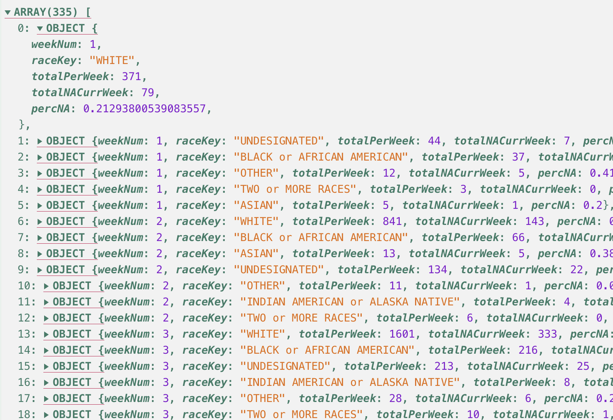
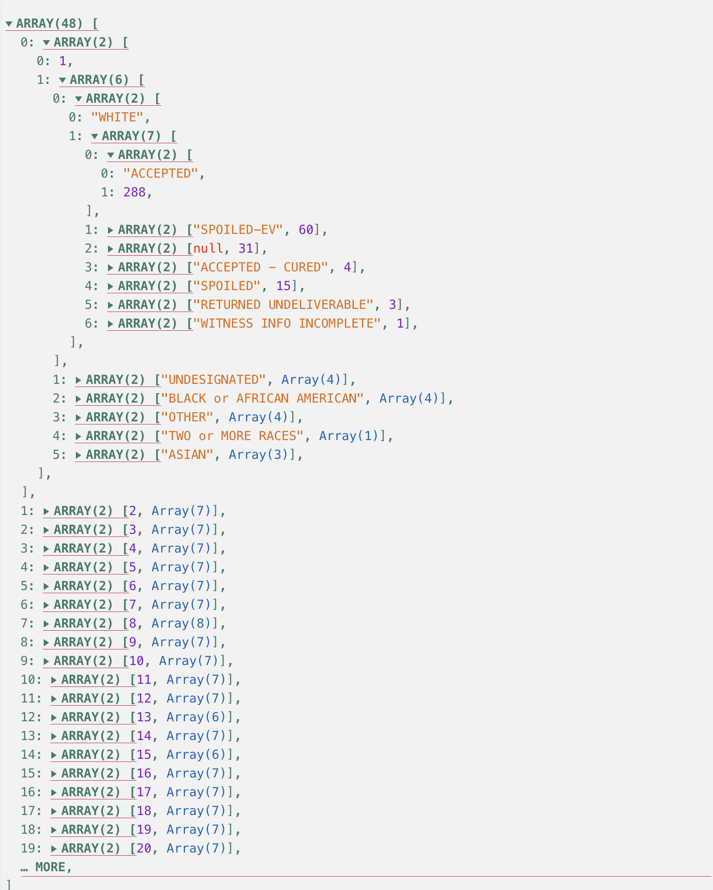

# 2.2-Creating Frequency Distributions

```js
import {utcParse,utcFormat} from "d3-time-format";
```

## Start Your GH Workflow

Remember, before you start anything else, always follow this GH methodological workflow:

1. Create meaningful **branch** that uses the agreed upon naming scheme: `CHP/X.x--lastname`.
2. Practice the iterative process to **commit** and **push** regularly with meaningful **commit messages**.

## Overview

In this chapter, we are going to learn about descriptive statistics related to frequencies and distributions of  the data. Descriptive statistics is essential to any data-driven work, because its a suite of techniques that will help you "read" and interpret large datasets. Indeed, we need to learn how to more quickly understand thousands and thousands of rows of information with sometimes dozens of features/columns. Descriptive statistics is one suite of tools to do this work.

We are going to follow a different case than the social worker, June, in *Statistics for Social Justice*. We are going to continue working with the 2024 NC absentee voter data.

## Learning Objectives

We're going to practice the following skills:

- **Statistics**:
  1. Understand **descriptive statistics**, **variables**, *values*, and *arrays*.
  2. Understand and learn how to compute 3 types of frequency distributions:
      1. Absolute
      2. Percentage
      3. Grouped
- **JavaScript**:
  1. Practice variable assignments, loops, conditions and functions in JS.
  2. Practice fetching, i.e., "attaching" data sets with `FileAttachment()`.
  3. Compute the 3 of the 4 types of frequency distributions with JS/D3.

## Readings

I recommend reading the S4SJ book alongside the completion of coding exercises in this OF notebook. You can read and reference the appropriate documentation, when completing pertinent code exercises. Indeed, the Observable & D3.js documentation readings are going to be important to review and have available for reference to complete this chapter's follow-along exercises.

1. ***Statistics for Social Justice***. Chapter 3 - "Frequency distributions and graphs" (pp. 25-44).
    <p class="note">Skip the graphing sections. We'll learn those techniques in 2.3.</p>
2. **Observable's Documentation**: Skim to understand & bookmark for quick referencing.
    1. Framework's "[Table input](https://observablehq.com/framework/inputs/table)"
3. **D3's Documentation**: Bookmark for quick referencing.
    1. [Grouping data](https://d3js.org/d3-array/group#rollups) with `.rollups()`.
    2. [Summarize data](https://d3js.org/d3-array/summarize#sum) with `.sum()`.

## 2.2.1 Attach the data set

Ok, let's attach and review the data with Observable's `FileAttachment()` and `Inputs.table()`.

Again, we are going to continue working with the 2024 NC absentee voter CSV file, `nc_absentee_mail_2024.csv`, which is located in `data` > `nc-voters`.

## E1. Attach the data

1. Convert the below codeblocks to executable `js` codeblocks.
2. Assign the data to a variable named `ncVotersAll`.
3. Render it to the page in a separate codeblock.

```javascript
// FileAttachment() code here assigned to `ncVotersAll`
```

Output the data as an interactive array of objects below:

<p class="codeblock-caption">
  Interactive output of full data set in <code>ncVotersAll</code>
</p>

```javascript
// Paste the `ncVotersAll` variable for the attached data here
```

## 2.2.2 Review the data as a table

We will be learning how to "read" large data sets with exploratory data analysis techniques, which include multiple visualizations. But, first, we shouldn't neglect to learn the simple table!

Observable has a suite of modules called **Inputs**. We're going to learn how to use [Observable's Inputs.table()](https://observablehq.com/framework/inputs/table) method to render the attached data as a table. In its most basic form, it expects a flat array of objects with properties, which is what `FileAttachment()` renders for us.

```javascript
// Convert this to an executable `js` block
// This is the most basic Inputs.table()
Inputs.table(ncVotersAll)
```

Notice how the table "lazily" loads data as you scroll down the data, so your browser doesn't explode!

## E2. Add custom features for `Inputs.table()`

Ok, that's easy, but that's way too much data for a table!

Let's create a new table below that reduces what we want to see by implementing the following options within a second parameter, which is an object `{...}` with the following properties:

- `columns`: Reduce the 17 columns to the following seven columns. Remember that you can access them via `data.columns`.
    ```javascript
    columns: [
      "id_num", "county_desc", "race", "gender", "age",
      "ballot_request_party", "ballot_rtn_status"
    ]
    ```
- `rows`: Default is 11.5. Let's change it to 25:
    ```javascript
    rows: 25
    ```
- `width`: Since some values in the table are short in length than others, let's define specific column widths. We can use an object where each provided column name is a key and value the desired width in pixels (px):
    ```javascript
    width: {
      id_num: 20,
      county_desc: 90,
      gender: 40,
      age: 20,
      race: 90,
      ballot_request_party: 90,
    }
    ```
- `header`: We can also rename the column names in the header. Use the desired original column names as keys in an object, where the values are new Strings to rename that column:
    ```javascript
    header: {
      id_num: "ID",
      county_desc: "County",
      race: "Race",
      gender: "Gender",
      age: "Age",
      ballot_request_party: "Ballot Party",
      ballot_rtn_status: "Ballot Status",
    }
    ```

Ok, now I want you to put all of those pieces together in your own `Inputs.table()` with the NC absentee voter data. Here's what it should look like:


```javascript
// Insert your table here
Inputs.table(
  // The array of objects
  ncVotersAll,
  {
    // enter each customizing property in this object
  }
)
```

## E3. Data Provenance

Before we move forward, it's usually a good idea to try to understand the data with any available external resources to uderstand its provenance. ***Provenance*** is essentially understanding the original context of people, places, intentions, and definitions of the dataset.

Luckly, in this case, NC provides a README.txt file, which I provided as a resource: [./../data/nc-voters/nc_absentee_readme.txt](./../data/nc-voters/nc_absentee_readme.txt). Review this for a moment. Then, respond to the following question.

**Question**: What's your short synopsis about the intention behind the data collection? And, are there any columns/fields that you are surprised about or spark any curiosities?

ENTER_YOUR_RESPONSE_HERE

## 2.2.4 Calculating Frequency Distributions & Case Scenario

To be honest, we should never really drop that much data into a table. Nobody wants or needs to review so much data at once.

Typically, we should reserve tables for smaller amounts of data for ourselves and our audience to review and comprehend. Let's learn how to compute and apply ***frequency distributions***, so we can reduce the data into a more meaningful set to tabulate.

Before we go any further, let's explain and practice frequency distributions through the following scenario:

> You work for a nonpartisan, nonprofit called Protect Democracy as an analyst and writer. One of PD's missions is to ensure free an fair elections. They want to run a series of stories about mail-in voting, and they recalled how, during the 2020 election, NC had racial disparity with regards to whose ballots were being rejected ([See 538 story](https://fivethirtyeight.com/features/north-carolina-is-already-rejecting-black-voters-mail-in-ballots-more-often-than-white-voters/)). Consequently, they want you to look into any potential rejected ballot issues that might have occurred for mail-in voters in NC during the 2024 election.

## 2.2.5 Calculate Absolute & Absolute Grouped Frequencies

We will need to learn a slightly new way to aggregate our data and calculate the absolute frequency of rejected, or not accepted, voter ballots per race category in a format that works with the `Inputs.table()` method. Enter the Rollups & Sum-up procedure with D3's `.rollups()` and `d3.sum()` methods!

### The rollups-sumup method

I should note that I coined this method's name, because it helped me remember a great go-to method for simple descriptive statistics work. Consequently, you won't find this method as a thing online beyond this course. `:-)`

The rollups-sumup method uses D3's `.rollups()`, which is just like the regular `.rollup()` that we learned in chapter 1.9. However, `.rollups()` does not return an `InternMap`. Instead, `.rollups()` creates a flattened version of the hierarchy of parent-child nodes as an Array of Arrays like the following skeletal pattern: `[ [...], [...], ... ]`.

The hierarchical parent-child node values in each array are positioned carefully in the hierarchical sequence defined in our `.rollups()` method. However, the last value in the leaf-node array is assumed as the entry values to perform some computation on.

In this case, the computed value is the absolute frequency of voters' ballot return status (`ballot_rtn_status`), which is grouped by their race (`race`). The resulting array of arrays will look like the following pattern:

<!-- Example output from .rollups() -->
```javascript
[
  [
    "ASIAN",
    [
      ["ACCEPTED", 8441],
      ["SPOILED-EV", 2260],
      ... // More per ballot_rtn_status
    ],
  ],
  [
    "TWO or MORE RACES",
    [
      ["ACCEPTED", 1484],
      ["SPOILED-EV", 340],
      ... // More per ballot_rtn_status
    ],
  ],
  ... // More per race
]
```

### 1. Roll it up with .rollups()!

Now that we need the overall output *data shape* and *data goal* achieved when using `.rollups()`, here's how we produce the above output with our `ncVotersAll` data.

1. Assign the output of d3.rollups() to a variable. We'll use the desired output as a guide for the name: `afStatusByRace`.
2. Within d3.rollups(), add our parameters separated by commas:
    1. Add first param: our array of objects: `ncVotersAll`.
    2. Add second param: the computation to perform on the rolled up data. In this case, we want the absolute frequency of ballot statuses per race.

<!-- Example rollups() -->
```javascript
/**
 * .rollups()
 * @return: a flattened version of InternMap:
 *   [ ["key", [entries as objects]], ... ]
**/
const afStatusByRace = d3.rollups(
  ncVotersAll,
  v => v.length, // length of race > ballot_rtn_status
  d => d.race,
    d => d.ballot_rtn_status
)
```

<p class="codeblock-caption">
  Interactive output of rolled up <code>afStatusByRace</code>:
</p>

<!-- afStatusByRace output -->
```javascript
// Convert to executable to see the output
afStatusByRace
```

### 2. Sum it up!

Let's learn and use D3's `.sum()`, because, while `.length()` worked for us to get the total of each instance in an array by finding its length, `d3.sum()` will help us do some more helpful and customizable `Number` work with addition. Indeed, sometimes, we will need to access properties in an object with the `Number` that we wish to tally within a collection, so `d3.sum()` enables us to iterate through a collection and access properties to find the sum total of that targeted property.

Here's the easiest way to use d3.sum(). The first parameter is required, which is any type of iterable. Since you do not need to explicitly define how to access the Number values in a simple array, like the example below, `d3.sum()` has been programmed to assume it is a simple array and sum it up.

```javascript
// d3.sum(iterable, accessor) // 10
d3.sum([1, 2, 2, 2, NaN, 3, null]) // 10
```

<p class="note">
  Note how any <code>null</code> or "Not A Number" (<code>NaN</code>) values are ignored automatically.
</p>

Ok, but what about our typical ***array of objects***? Well, accessors to the rescue! The second optional parameter for `d3.sum()` is an accessor function, which tells `d3.sum()` which object property to access and iteratively add to the total.

In the example below, our iterable is an array of objects, `fruitCollection`, wherein we have 2 properties: total of `apples` and `oranges`. If we wish to find the sum of all of the `apples` in `fruitCollection`, we pass `fruitCollection` as the iterable, then use the `apples` property key in the accessor function. Then, `d3.sum()` does the rest for us!

<!-- Example of d3.sum() & fruitCollection -->
```javascript
const fruitCollection = [
  {apples: 20, oranges: 0},
  {apples: 10, oranges: 50},
  {apples: 0,  oranges: 60},
  {apples: 40, oranges: 20},
  {apples: 30, oranges: 30},
]

const applesSum = d3.sum(
  fruitCollection,  // iterable
  ((d) => d.apples) // accessor
)

// applesSum == 100
```

Alright, now that we have a more robust method to summarize the data with `d3.sum()`, let's see it in action within a more relatable situation.

Below, we continue our running example of finding the frequency distribution of ballot statuses per race in the 2024 NC election data. Remember that we need to count the *absolute frequency* of all ***ballots per race*** and ***all rejected ballots per race***. To sum up those two values, we can use the .map() method to iterate our flat rollup of `afStatusByRace` and count all ballots per race and only rejected ballots per race.

Here's the hefty codeblock with comments documenting the steps to arrive at our desired goal. Please note that I explain this process and codeblock in more detail in the video in the next review section.

<!-- Render voterAcceptedOrNotTotals for book -->
```javascript
const voterAcceptedOrNotTotals = afStatusByRace.map(
  // Spread assign key & entries at race level
  ([race, raceEntries]) => {

    // 1. Get total of each ballot status per race
    /**
     * ### d3.sum() ###
     * Iterate through all of the per race `entries`
     * of `ballot_rtn_status` and compute their sum total
     * @return Number. Sum total of each `ballot_rtn_status` per race
    **/
    const total = d3.sum(
      // 1.1. race's entries per ballot_rtn_status
      raceEntries,
      // 1.2. Accessor Function.
      //    @param: Array. Spread `raceEntries` of [status, value]
      ([ballotStatus, value]) => {
        return value
      }
    )

    // 2. Only count not accepted absentee ballots
    const notAccepted = d3.sum(
      // 2.1. race's entries per ballot_rtn_status
      raceEntries,
      // 2.2. Accessor Function.
      //    @param: Array. Spread `raceEntries` of [status, value]
      ([status, value]) => {
        /**
         * 2.3. Use conditions to isolate desired data
         *   if ballot_rtn_status is null,
         *   then voter never sent back in
         *   or wasn't recorded as received,
         *   so do not count
        **/
        if (status != null) {
          /**
           * 2.4. Use condition and .startsWith()
           *   to determine whether a string begins
           *   with the characters of a specified string.
           *   Returns boolean, true or false, as appropriate.
          **/
          if (status.startsWith("ACCEPTED") == false) {
            return value
          }
        // Ignores Accepted to get total of all rejected statuses
      }
    })
    /**
     * 3. Return object with absolute frequencies
     *   of total ballots and total rejected ballots
     *   per race category.
    **/
    return { race, total, notAccepted }
  }
) // end of .map()
```

<p class="codeblock-caption">
  Interactive output of rolled up and summed up <code>voterAcceptedOrNotTotals</code>:
</p>

<!-- voterAcceptedOrNotTotals output -->
```javascript
// Convert to executable block to see the output
voterAcceptedOrNotTotals
```

## 2.2.6 Review the Rollup & Sumup Process

Watch the following explainer video about the data-design work to arrive at the basic frequency distributions with the Rollup & Sumup process.

<video controls style="width: 620px; height:620px">
  <source src="./../assets/vids/02-why-stats/02-freq-dist-map.mp4" type="video/mp4" />
</video>

## E4 Tabulated absolute frequencies of rejected ballots per race

Ok, tabulate the rolledup and summed-up `voterAcceptedOrNotTotals` with `Inputs.table()`. Be sure to also complete the following customizations:

1. Rename the columns to names that are more helpful, such as `"Voter's Race"`, `"Total Absentee Ballots"`, and `"Total Rejected Absentee Ballots"`.
2. Adjust the `width` and alignment (`align`) properties of the columns.
3. Sort the table based on what you deem the most helpful combo of column and ascending vs. descending.
4. Be sure to provide a short response to the question about your table design.

```javascript
// Enter your table here
```

### Question: Explain your table design choices.

**Q**: What *insights* and *new questions* did you garner from it that you hope to also illustrate/provide for your audience?

ENTER_YOUR_RESPONSE_HERE

## 2.2.7 Calculate Grouped Frequency Percentages

Some of the above grouping, frequency, and tabulation work inspires new angles and questions to pursue. One such question might be about trying to better understand the absolute frequencies computed above. Indeed, when dealing with population demographics in particular, it is good to consider different ways to group and represent the distribution of the data. If we look back at the data and see the absolute frequencies grouped by race, it's hard to distinguish if the absolute numbers are significant or not. Even if we know that the majority of people in North Carolina are white, those high absolute frequencies in the white racial group seem to overshadow all other racial groups.

We can start to remedy this issue as communicators by computing percentages within each racial category. If we convert the absolute frequencies to percentages within each racial category, we can then perhaps see if there are any discrepencies between groups. Additionally, we might be interested in creating a more interesting grouping of the data based on the date a voter requested their mail-in ballot. In NC, voters have until 5 p.m. the Tuesday before Election Day to request an absentee/mail-in ballot. For the 2024 General Election, that means people had until October 29th to request a mail-in ballot!

So, in our running case, let's say that one angle that your above work helped you see and then consider asking about is ***What percentage of ballots were rejected, based on when the voter requested their mail-in ballot and their race?*** When thinking about the "when" part of this angle, we should consider how it might be more helpful to group the data at a **per week** level, rather than group it at a **per day** level. In short, a **per week** level reduces the data without losing some fidelity of seeing potential patterns over time.

To begin to answer this question, we first need to consider if we have the data we need to then be able to create a newly grouped and computed dataset.

Let's break down the angle to create a list of data needs:

1. Dataset grouped by **week** ("when the voter requested their mail-in ballot") and
2. **race** ("their race").
3. Absolute frequency of rejected ballots based on this grouping.
4. Absolute frequency of all ballots, based on this grouping.
5. Percentage of rejected ballots based on the grouping.

In the end, our new dataset to address this angle should include an array wherein each object should have 5 properties: week number, race, total rejected ballots based on the original requested week, total ballots requested during the week, and the percentage of those absolute frequencies. Can you see the problem yet with our needs? We have the race category in the original dataset, but nothing else is available in the original attached data assigned to `ncVotersAll`.

Thankfully, we know how to roll up and sum up the data now. We also know that we can convert dates that are in the String data type to JS Date() objects with D3 date parser methods. Once we create and add date objects, then we can use a D3 date formatter to isolate a week number for each voter ballot entry in the dataset. Based on these data needs, here's a basic to-do list for our coding work:

1. Convert all requested ballot dates (`.ballot_req_dt`) to date objects.
    1. Use a D3 date parser to set a new `.ballot_req_dt_obj` date Object value, and be sure to check and skip null date values.
    2. Use a D3 date formatter to set a new ballot request week number as `.ballot_req_week` property.
2. Roll up the data by:
    1. Grouping the data by **ballot request week number** > **race** > **ballot return status**.
    2. Compute the total number of ballot requests during that week for each grouping.
3. Flatten the rolled up data and add the following
    1. Compute the total number of ballot requests during that week for each **week** > **race** grouping.
    2. Compute the total number of ballots requested that remain rejected for each **week** > **race** grouping.
    3. Compute the percentage of rejected ballots, which were requested for each **week** > **race** grouping.

In the end, here's an example the new array of objects:



Roll up your sleeves and let's start coding this new data!

## E5. Convert Dates to Date Objects

Think back to chapter **1.7 - Dates & Time**. We learned how date information in datasets are often tricky to work with, so we need to learn how to convert date values to Date() objects, which we can do easily with D3.js' date parsers and formatters.

<p class="tip">
  Here is D3's list of <a href="https://d3js.org/d3-time-format#locale_format" target="_blank" rel="noopenner noreferrer">time format specifiers from their user doc page</a>.
</p>

### 1. Create your parser and formatter

In the below codeblock, create the following date parser and formatter:

1. A `utcParse()` date parser assigned as a constant variable called `parseDate`.
    <p class="tip">
      This parser needs to recognize the following String format for dates: `"0/0/00"` - Month / Date / Year.
    </p>
2. A `utcFormat()` formatter assigned as a constant variable called `formatWeekNumber`.
    <p class="tip">
      We want it to convert a Date() to the week number in a ***leading-zero format***.
    </p>

<!-- D3 Date Parsers -->
```javascript
// Convert to an executable, then add your parser and formatter here
```

### 2. Iterate `ncVotersAll` with `.map()` to add date object & week number

Now that we have our date parser and formatter to create the desired new properties, let's apply them to each date instance in `ncVotersAll` by iterating it with JS' `.map()`.

Remember that JS' `.map()` is simply a fancy for loop, which we learned in [Chapter 1.9 - Objects & Maps](http://127.0.0.1:3000/01-Learning-JS/09-objs-maps.html#iterate-iterables-with-map). In our case with `ncVotersAll`, each object in the array represents one mail-in voter's ballot, so we can expect that the basic skeletal structure of our mapping method can look like the following codeblock:

<!-- Example .map() codeblock -->
```javascript
// .map() expects a Function as a parameter
const ncVotersAllUpdated = ncVotersAll.map(
  (ballot) => {
    /**
     * Do something with `ballot` in here.
     * HINT: Some dates are null values, so
     *       you'll need to conditionally
     *       skip them, or else you will
     *       receive errors, since date
     *       parsers don't like null.
    **/
    return ballot // return newly updated `ballot`
  }
)
```

Ok, now convert the below codeblock to an exectuable one, so you can view the output.

<p class="codeblock-caption">
  Interactive output of <code>ncVotersAllUpdated</code> with new date properties:
</p>

```javascript
ncVotersAllUpdated
```

### 3. Roll up the ballot rejections in `ncVotersAllUpdated` with `.rollups()`

Ok, now that we have a new week number data property at the per voter ballot level, we are going to use `d3.rollups()` on `ncVotersAll` to group and count the length of the following grouping sequence: `ballot_req_week` > `race` > `ballot_rtn_status`.

Write the code to create this new rolled-up version of the data and interactive output in the below codeblocks.

The output should resemble something like the example image below:



```javascript
// Your rollups code here
```

<p class="codeblock-caption">
  Interactive output of rolled up ballot rejections:
</p>

```javascript
// Add assigned rolledup data here for interactive output
```

### 4. Sum up the rejection counts & compute percentage of column

Alright, this is the hardest codeblock that you will have written so far, but you got this! Let's slow down and think about what data we need to design here, so we can follow our angle about ballot rejections for each race, based on when - what date - the voter requested a mail-in ballot. Here's what we've accomplished so far:

1. With JS' `.map()`, iterate over the `ncVotersAll` data to create a new array of objects with new properties (`ncVotersAllUpdated`): a date object & isolated week numbers for each voter's request data of a mail-in ballot.
2. With `.rollups()`, roll up the updated `ncVotersAllUpdated` data via the following sequence: `ballot_req_week` > `race` > `ballot_rtn_status`. Then, add the length as a `Number`, based on the total leaf node count of the return status of ballots.

Now, we need to count the absolute frequency of:

1. ALL ballots per our grouping, and
2. ONLY not accepted ballots per our grouping

After we count these two values, we can then calculate the frequency percentage to contextualize the numbers in relationship to their own group and add them to a new object that has all of the grouped values in a flattened object that will look something like this array of 335 objects:

```javascript
[
  {
    weekNum: 1
    raceKey: "WHITE"
    totalPerWeek: 371
    totalNACurrWeek: 79
    percNA: 0.21293800539083557
  },
  {
    weekNum: 1
    raceKey: "UNDESIGNATED"
    totalPerWeek: 44
    totalNACurrWeek: 7
    percNA: 0.1590909090909091
  },
  ...
]
```

Instead of using .map(), we are going to use the nice and simple for...of loop to iterate down to each level in our grouping's hierarchy, so we can count the total ballots and total rejected ballots per week>race.

This is still going to be tricky for you, and that's ok. I have supplied you with starter-code, so you can see how we can accomplish this goal for the data design. Be sure to review the comments that explain each step, then convert the code to an exectuable codeblock and finish the work, so you populate `voterNATotalsPerWeek` with 335 objects like the example I provided above.

<!-- Starter codeblock to sum up -->
```javascript
// 1. Declare/instantiate empty array to populate
const voterNATotalsPerWeek = []

/**
 * 2. Use for...of loops to loop through each level
 *
 * Remember that .rollups() flattens key->value pairs
 * into nested arrays [ ["key", [value1, value2, ...], ...], ...]
 * So, we can spread assign them in the parameter
 * in our for...of loop.
**/
for (const [week, weekEntries] of ballotsPerWeek) {

  // 2.1 Convert week number (String) to a Number
  // We'll talk later about why
  const weekNum = Number(week)

  // 3. Loop through each race in current week
  for (const [raceKey, raceEntries] of weekEntries) {

    // 3.1. Count total ballots per raceEntries,
    // skip null values
    const totalPerWeek = d3.sum()

    // 3.2. Count total not accepted ballots per raceEntries,
    // skip the null values
    const totalNACurrWeek = d3.sum()

    // 3. Calculate percentage of total rejected ballots
    const percNA = //Add percentage calculation here

    // 4. Push all values to voterNATotalsPerWeek array
    // weekNum, raceKey, totalPerWeek, totalNACurrWeek, percNA
    // Enter code here

  }
}
```

<p class="codeblock-caption">
  Interactive output of flattened summed up <code>voterNATotalsPerWeek</code>
</p>

```javascript
// Convert to executable block to see the output
voterNATotalsPerWeek
```

## E6. Tabulate `voterNATotalsPerWeek`

```javascript
// Convert to executable block to see the output
Inputs.table(
  voterNATotalsPerWeek,
  // add any customizations, if desired
)
```

**Question**: After tabulating the data, as well as sorting and reviewing it, what new angles and questions come to mind?

YOUR_RESPONSE_HERE

## Conclusion

In the end, our table above still had lots of information to parse and understand more. In the next chapter, we're going to pick up where we left off and learn how to visualize this information with Observable Plot. For example, we'll learn how to create the following line chart that isolates the two largest racial groups represented in the data: `"WHITE"` and `"BLACK or AFRICAN AMERICAN"`.

<video controls style="width: 620px; height:620px">
  <source src="../assets/vids/02-why-stats/02-voter-reject-perc.mp4" type="video/mp4" />
</video>

## Submission

1. Create a **PR** (**pull request**) and use the provided content in the template to start it.
2. Respond to your peers and comment on their work too.
3. Submit the PR link in Moodle, when you're ready.
