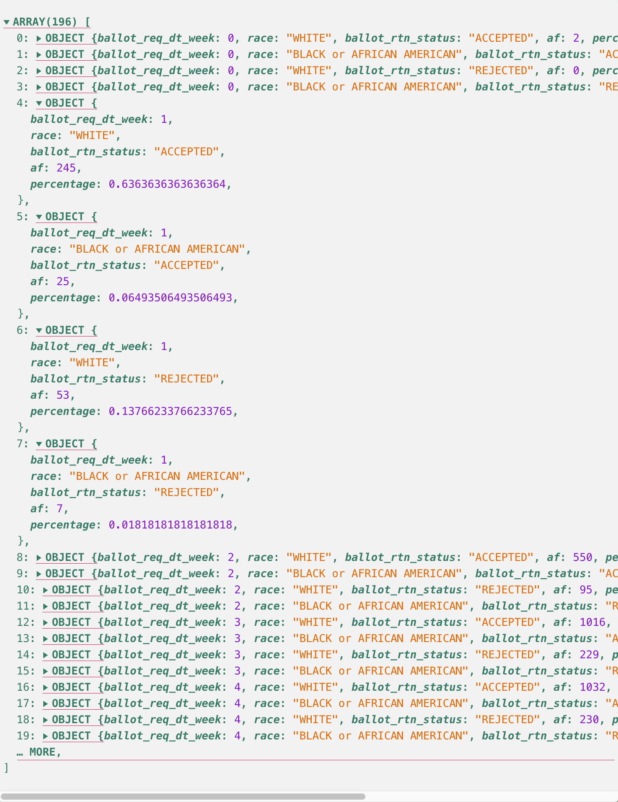
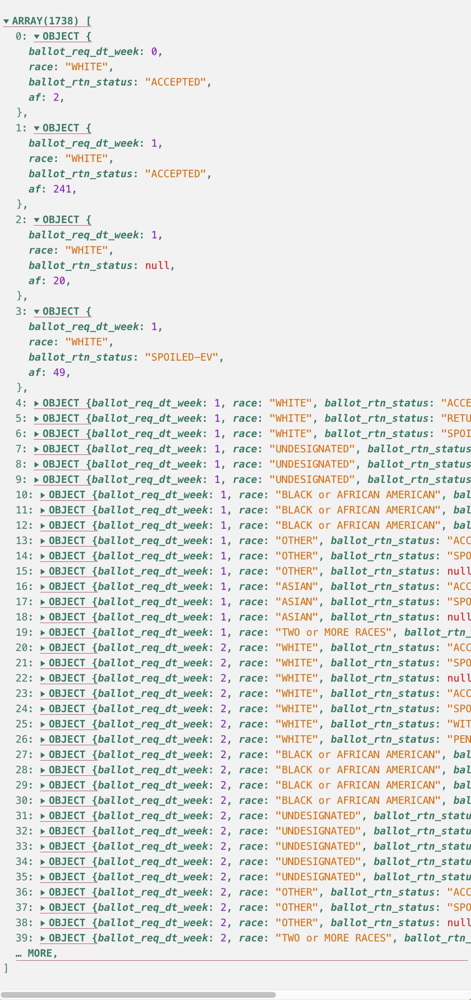

# Exercise for 2.3 - Creating Groups & Frequency Distributions

<!-- IMPORT YOUR MODULES -->
```js
import {utcParse,utcFormat} from "d3-time-format";
// Import your custom modules here: getUniquePropListBy, oneLevelRollUpFlatMap, twoLevelRollUpFlatMap, threeLevelRollUpFlatMap, sumUpWithReducerTests
import {getUniquePropListBy, mapDateObject, threeLevelRollUpFlatMap} from "./utils/utils.js";

```

## Start Your GH Workflow

Remember, before you start anything else, always follow this GH methodological workflow:

1. Create meaningful **branch** that uses the agreed upon naming scheme: `CHP/E-X.x--name_of_chp`.
2. Practice the iterative process to **commit** and **push** regularly with meaningful **commit messages**.

## Learning Objectives

Since this is an extended exercise of Chapter 2.3, we're going to practice the same following skills with *one new objective to integrate percentages*:

- **Statistics**:
  1. Understand **descriptive statistics**, **variables**, *values*, and *arrays*.
  2. Understand and learn how to compute 3 types of frequency distributions:
      1. Absolute
      2. Grouped
      3. ***Percentages*** - New objective
- **JavaScript**:
  1. Practice variable assignments, loops, conditions and functions in JS.
  2. Practice fetching, i.e., "attaching" data sets with `FileAttachment()`.
  3. Practice the RFS method to compute the 3 of the 4 types of frequency distributions with JS/D3.
  4. Practice writing exportable functions in a local file to import and use in our notebooks.

## Readings

Same readings as Chapter 2.3.

1. ***Statistics for Social Justice***. Chapter 3 - "Frequency distributions and graphs" (pp. 25-44).
    <p class="note">Skip the graphing sections. We'll learn those techniques in 2.3.</p>
2. **Observable's Documentation**: Skim to understand & bookmark for quick referencing.
    1. Framework's "[Table input](https://observablehq.com/framework/inputs/table)"
3. **D3's Documentation**: Bookmark for quick referencing.
    1. [Grouping data](https://d3js.org/d3-array/group#rollups) with `.rollups()`.
    2. [Summarize data](https://d3js.org/d3-array/summarize#sum) with `.sum()`.
4. **MDN Javascript Guide**: Skim and bookmark for quick referencing:
    1. [Flatten nested arrays](https://developer.mozilla.org/en-US/docs/Web/JavaScript/Reference/Global_Objects/Array/flatMap) with `.flatMap()`

## Overview of Exploratory Data Analysis Exercise

In this extended exercise, we're building on our scenario of working at Protect Democracy (PD). The work you completed in chapter 2.3 is typically called ***exploratory data analysis*** (EDA). It's been called EDA because all of this grouping, frequency, and tabulation work inspires new angles and questions to pursue. One such question might be about trying to better understand the absolute frequencies computed above. Indeed, when dealing with population demographics in particular, it is good to consider different ways to group and represent the distribution of the data. If we look back at the data and see the absolute frequencies grouped by race, it's hard to distinguish if the absolute numbers are significant or not. Even if we know that the majority of people in North Carolina are white, those high absolute frequencies in the white racial group seem to overshadow all other racial groups.

We can start to remedy this issue as communicators by computing ***percentages*** within each racial category. If we convert the absolute frequencies to percentages within each racial category, we can then perhaps see if there are any discrepencies between groups.

Additionally, we might be interested in creating a more interesting grouping of the data based on the date a voter requested their mail-in ballot. *In NC, voters have until 5 p.m. the Tuesday before Election Day to request an absentee/mail-in ballot.* For the 2024 General Election, that means people had until October 29th to request a mail-in ballot.

So, in our running case, let's say that one angle that your prior EDA work helped you see and then consider asking about is the following question:

> ***What percentage of ballots were rejected, based on when the voter requested their mail-in ballot and their race?***

When thinking about the "when" part of this angle, we should consider how it might be more helpful to group the data at a **per week** level, rather than group it at a **per day** level. In short, a **per week** level reduces the data without losing some fidelity of seeing potential patterns over time.

### What data do we need?

To begin to answer this question, we first need to consider if we have the data we need to then be able to create a newly grouped and computed dataset.

Let's break down the angle to create a list of data needs:

1. Dataset grouped by **week** ("when the voter requested their mail-in ballot").
2. The available **race** values.
3. Absolute frequency of rejected ballots based on this grouping.
4. Absolute frequency of all ballots, based on this grouping.
5. Percentage of rejected ballots based on the grouping.

In the end, our new dataset to address this angle should include an array wherein each object should have 5 properties: week number, race, total rejected ballots based on the original requested week, total ballots requested during the week, and the percentage of those absolute frequencies.

### Plan out data transformation

Can you see the problem yet with our needs? We have the race category in the original dataset, but nothing else is available in the original attached data assigned to `ncVotersAll`.

Thankfully, we know and have written code to conduct the RFS method across two grouped levels of data. We also know that we can convert dates that are in the String data type to JS Date() objects with D3 date parser methods. Once we create and add date objects, then we can use a D3 date formatter to isolate a week number for each voter ballot entry in the dataset. Based on these data needs, here's a basic to-do list for our coding work:

1. Convert all requested ballot dates (`.ballot_req_dt`) to date objects.
    1. Use a D3 date parser to set a new `.ballot_req_dt_obj` date Object value, and be sure to check and skip null date values.
    2. Use a D3 date formatter to set a new ballot request week number as `.ballot_req_week` property.
2. Roll up the data across 3 levels by:
    1. Grouping the data by **ballot request week number** > **race** > **ballot return status**.
    2. Compute the total number of ballot requests during that week for each grouping.
3. Flatten the rolled up data and add the following
    1. Compute the total number of ballot requests during that week for each **week** > **race** grouping.
    2. Compute the total number of ballots requested that remain rejected for each **week** > **race** grouping.
    3. Compute the percentage of rejected ballots, which were requested for each **week** > **race** grouping.

In the end, here's an example the new array of objects:



Roll up your sleeves and let's start coding this new data!

## E1. Attach the data

Let's attach and render the dataset CSV file called `nc_absentee_mail_2024_no_dropped_dupes.csv` out to the page, so we can reference it, when needed.

Let's assign the attached data to a constant variable called `ncVotersAll`.

```js
let ncVotersAll = FileAttachment("../data/nc-voters/nc_absentee_mail_2024_no_dropped_dupes.csv").csv ({typed: true})
```

<p class="codeblock-caption">
  Output of full dataset
</p>

```js
ncVotersAll
```

## E2. Convert String Dates to Date() Objects

Think back to chapter **1.7 - Dates & Time**. We learned how date information in datasets are often tricky to work with, so we need to learn how to convert date values to Date() objects, which we can do easily with D3.js' date parsers and formatters.

<p class="tip">
  Here is D3's list of <a href="https://d3js.org/d3-time-format#locale_format" target="_blank" rel="noopenner noreferrer">time format specifiers from their user doc page</a>.
</p>

Copy and paste the code and comments in the larger codeblock below into your `utils.js` file. The exercise will ask you to complete the following 4 broader steps:

1. A `utcParse()` date parser assigned as a constant variable called `parseDate`.
    <p class="tip">
      This parser needs to recognize the following String format for dates: <code>"00/00/0000"</code> - Month / Date / Year.
    </p>
2. A `utcFormat()` formatter assigned as a constant variable called `formatWeekNumber`.
    <p class="tip">
      We want it to convert a Date() to the week number in a <strong><em>leading-zero format</em></strong>.
    </p>
3. This may seem strange, but I want you to wrap your `utcFormat()` inside of a `Number()` method. `Number()` will convert the formatted week number String type to a Number type. The result of steps 2 and 3 should resemble the following:
    ```javascript

    // Executes utcFormat() first, then Number().
    Number(utcFormat("SPECIFIER_STRING_IN_HERE"))

    ```
    <p class="warning">Be sure that you double check your open and close parentheses.</p>
4. Once you create your date parser and formatter, you can follow the directions inside of the future exportable function that uses `.map()` to create the desired new properties.
    <p class="tip">
      Remember that JS' <code>.map()</code> is simply a fancy for loop, which we learned in <a href="/01-Learning-JS/09-objs-maps.html#iterate-iterables-with-map" target="_blank" rel="noreferrer noopenner">Chapter 1.9 - Objects & Maps</a>. In our case with <code>ncVotersAll</code>, each object in the array represents one mail-in voter's ballot.
    </p>

Ok, the code below has already been added to the `utils.js` file, so be sure to open the `utils.js` file to start your importable coding work!

<p class="tip">
  I highly recommend opening a <strong>two-column layout in VS Code</strong>, so you can see both files as you work on each part of this exercise.
</p>

<!-- Example export codeblock -->
```javascript
/** ======================================
 * This code is in the utils.js file
 * for this section of the book.
 * =================================== **/

/**
 * 0. In the export utils.js file,
 *    create a date parser named `parseDate`,
 *    if needed. And, create a week date
 *    formatter with utcFormat()–call it
 *    `formatWeekNumber`
**/

/**
 * 1. Create your general Date object function:
 *    mapDateObject().
 *    Pass in your `data` (Array of objects) and
 *    the property name for the date field, whose
 *    value is a string `dateString`.
**/
export const mapDateObject = (data, dateString) => {

  // 2. Use .map() to iterate the `data` and create new date props
  const updatedData = data.map((ballot) => {

    // 3. Create dynamic keys to use for new properties
    const objField = dateString+"_obj"
    const weekField = dateString+"_week"

    // 4. Skip any null request dates
    if (ballot[dateString] != null) {
      /**
       * 5. Assign a date object to a new
       *    property for each `ballot`
       *    called `objField`.
      **/
     ballot[objField] = parseDate(ballot[dateField])
    }
    return ballot
  })

  /**
   * 5. Sort the data by week numbers in ascending order.
   * I also recommend sorting your data
   * in ascending order before returning
   * it back, since you normally want your
   * data to mirror the concept recorded.
   * In this case, weeks are temporal data
   * in a chronological sequence: 1, 2, 3, ...
  **/
  const sortedData = updatedData.sort(
    // Works like an accessor function to pass two objects to compare
    (a, b) => {
      // Uses D3's ascending() function to sort by the given properties
      return ascending(a.ballot_req_dt_week, b.ballot_req_dt_week)
    }
  )

  // 6. Return the populated and sorted array of objects
  return sortedData

}
```

Import the `mapDateObject` function in the `import` statement at the top of this page, so you can start to develop and test it as you use it. I have already imported the `getUniquePropListBy()` function from `utils.js`, so you only need to add a comma after it—like you do in Arrays.

<p class="tip">
  Console logs are your friend for testing your code! Just be sure to erase them, when you don't need them anymore.
</p>


```js
// Convert so you can test your imported function as you develop it
const ncVotersAllUpdated = mapDateObject(ncVotersAll, "ballot_req_dt")
```

Ok, now convert the below codeblock to an exectuable one, so you can view the output.

<p class="codeblock-caption">
  Interactive output of <code>ncVotersAllUpdated</code> with new date properties:
</p>

```js
// Convert to output
ncVotersAllUpdated
```

## E3. Conduct RFS with threeLevelRollUpFlatMap() function

Ok, now that we have a new week number date property at the *per voter ballot level*, you need to create a three-level grouping, so we can count the length of the following grouping sequence: `ballot_req_week` > `race` > `ballot_rtn_status`.

It's time to take your knowledge of one-level and two-level RFS method and create an RFS function that can handle a ***three-level grouping***! Write and test your new `threeLevelRollUpFlatMap()` function in the `utils.js` file by adding the function to your import statement at the top of this file.

<p class="tip">
  <code>threeLevelRollUpFlatMap()</code>'s structure and parameters will follow from <code>twoLevelRollUpFlatMap()</code>, so you can copy and paste this existing function to jump start your work.
</p>

The output should resemble something like the example image below:

<p class="figure-caption">
  Output of .rollups() & .flatMap() per ballot_req_dt_week > race > ballot_rtn_status.
</p>



<p class="tip">
  Be sure to import your <code>threeLevelRollUpFlatMap()</code> function from utils.js by adding it to the import statement at the top of this file.
</p>

Now use your `threeLevelRollUpFlatMap()` here.

```js
/**
 * Convert and use `threeLevelRollUpFlatMap()`
 * and assign to a const `afByWeekRaceStatus`.
**/
const afByWeekRaceStatus = threeLevelRollUpFlatMap(ncVotersAllUpdated, "ballot_req_dt_week", "race", "ballot_rtn_status", "af")
```

<p class="codeblock-caption">
  Interactive output of ballot's per week:
</p>

```js
// Convert to output afByWeekRaceStatus
afByWeekRaceStatus
```

## E4. Sum Up & Grouped Percentages with Reducer Tests for 3 Levels

Now that you have a flattened absolute frequency count at the per week > race > ballot status level, we need to reduce and sum up those counts to an either `"ACCEPTED"` or `"REJECTED"` ballot status.

The result should resemble the following output:

<p class="figure-caption">
  Output of summing up the absolute frequencies per ballot_req_dt_week > race > ballot_rtn_status.
</p>


### 4.1 Write your reducer functions

<!-- Reducer Functions -->
```js
/**
 * Write a reducer function that checks to make sure
 * ballot_rtn_status is NOT null and starts with "ACCEPTED"
 *    If true, return the 'af' value for the object
 *    If false, return 0
**/

// Now, do the same for what will become "REJECTED" statuses
const getAcceptedBallots = (d) => {
  if (d.ballot_rtn_status != null && d.ballot_rtn_status.startsWith("ACCEPTED") == true){
    return d.af
  }
  else {
    return 0
  }
}
const getRejectedBallots = (d) => {
  if (d.ballot_rtn_status != null && d.ballot_rtn_status.startsWith("ACCEPTED") == false){
    return d.af
  }
  else {
    return 0
  }
}

```

### 4.2 Write your reducer properties and objectify your reducer functions

<!-- Reducer Properties & Objectify reducerFuncs -->
```js
const reducerProps = [
  "WHITE", "BLACK or AFRICAN AMERICAN"
]

const reducerFuncs = [
  {
    type: "ACCEPTED",
    func: getAcceptedBallots
  },
  {
    type: "REJECTED",
    func: getRejectedBallots
  },
]

/**
 * Here's a gimme function that I already imported.
 * getUniquePropListBy() in utils.js can help you create
 * a unique list of a specific property in the array of objects.
 * EXAMPLE: A unique list of week numbers for `ballot_req_dt_week`
**/
const uniqueListOfWeekNumbers = getUniquePropListBy(
  // Dataset
  afByWeekRaceStatus,
  // Specific key to pass
  "ballot_req_dt_week"
)
```

### 4.3 Create custom for loop to calculate sums & percentages

Instead of creating a generalizable function for all three-level cases, some times it is best to just write the code for your case. So, in the codeblock below, I have provided an outline of how to simply use for loops to complete our overall task to create our new dataset.

Convert the below codeblock and develop it further in this notebook to complete the task. We're not creating a module, because sometimes the complexity of the situation just demands using simpler methods to meet the situation. Indeed, there's nothing wrong with using the helpful set of for loops and conditions to get the job done. `:-)`

<!-- Counting it all up through a series of custom loops -->
```js
// 1. Create array for tallied frequency results
const afGroupedPercResults = []

// loop through week #s
for (const weekNumber of uniqueListOfWeekNumbers){

  // loop through reducer func (ballot status)
  for (const testorObj in reducerFuncs){

    // loop through reducer properties (race)
    for (const rProperty in reducerProps){

      // sum for all races and status per week
      const weekAf = d3.sum(
        afByWeekRaceStatus,
        (d) => {
          if (d.ballot_rtn_status != null && d.ballot_req_dt_week == weekNumber && d.race == reducerProps[rProperty]){
            return d.af
          }
        }
      )

      // talley frequency
      const summedUpLevel = d3.sum(
        afByWeekRaceStatus,
        (d) => {
          if (d.ballot_req_dt_week == weekNumber && d.race == reducerProps[rProperty]){
            const xTotalToSum = reducerFuncs[testorObj]["func"](d)
            return xTotalToSum
          }
        }
      )

      //push to array
      afGroupedPercResults.push({
        ballot_req_dt_week: weekNumber,
        race: reducerProps[rProperty],
        ballot_rtn_status: reducerFuncs[testorObj]["type"],
        af: summedUpLevel,
        percentage: summedUpLevel/ weekAf,
      })
    }
  }
}
```

<p class="codeblock-caption">
  Output of afGroupedPercResults.
</p>

```js
afGroupedPercResults
```

## E5. Tabulate `afGroupedPercResults`

Tabulate the data here. Use `Inputs.table()`'s `format` option to express the percentage values set to the second decimal place with a decimal sign (%), as follows: `00.00%`.

<p class="tip">
  Similar to date formatters, D3's d3-format library can help you format percentage values. (Reference the <a href="https://d3js.org/d3-format#locale_format" target="_blank" rel="noreferrer noopenner">d3-format docs</a>).
  <br>
  <br>
  You can then use <code>Inputs.table()</code>'s <code>format: { object_key: (x) => //use `x` in an accessor here, // Add more ... }</code> to express data appropriately. (Reference Observable Framework's <a href="https://observablehq.com/framework/inputs/table#inputs-3a86ea-4" target="_blank" rel="noreferrer noopenner">example in their docs</a>)
</p>

```js
Inputs.table(
  afGroupedPercResults,
  {
    format: {
      percentage: d3.format(".2%")
    }
  }
)
// Convert and tabulate afGroupedPercResults here
```

## Question: Why not percentage of all ballots per week?

Why did I direct you to sum the total for the week > race group, rather than calculate the percentage based on the grand sum total for the entire week across all included races? How are those percentages' respective *interpretive levels* different?

Grouping by race allows us to easily compare the differences in accepted versus rejected ballots per week based on racial group. If we want to look at how ballots were processed over time we could only group by week. However, since we are interested in how race plays a factor, the data needs to be grouped by race too.

## Question: New insights?

After tabulating the data, as well as sorting and reviewing it, what new angles and questions come to mind?

I am curious about how time impacts the acceptance of ballots. For most weeks, black/african american ballots were rejected more often than white ballots. However, there are a few weeks towards the beginning of the year where this trend is reversed. Are there common reasons (i.e., why ballots were rejected) each week, for example, is their a spike in photo ID issues one week?

## Question: Difficulties?

After tabulating the data, as well as sorting and reviewing it, what difficulties are you experiencing as you review so much data in a table?

It is hard to read and parse through all the data in the table. It is also hard to visualize patterns and trends. A chart would be useful to help the visualization process.

## Conclusion

In the end, our table above still had lots of information to parse and understand more. In chapter 2.4, we will pick up where we left off here and learn how to visualize this information with Observable Plot. For example, we'll eventually learn how to create the following line chart of our per week grouped data: `"WHITE"` and `"BLACK or AFRICAN AMERICAN"`.

<video controls style="width: 620px; height:620px">
  <source src="../assets/vids/02-why-stats/02-voter-reject-perc.mp4" type="video/mp4" />
</video>

### What's next? "The humanity of data"

However, let's take a short reflective break from the data work. In the next chapter, we will learn more about the complexity of data as a communicative object--an object that is tangled up in so many issue of power.

## Submission

1. Create a **PR** (**pull request**) and use the provided content in the template to start it.
2. Respond to your peers and comment on their work too.
3. Submit the PR link in Moodle, when you're ready.
