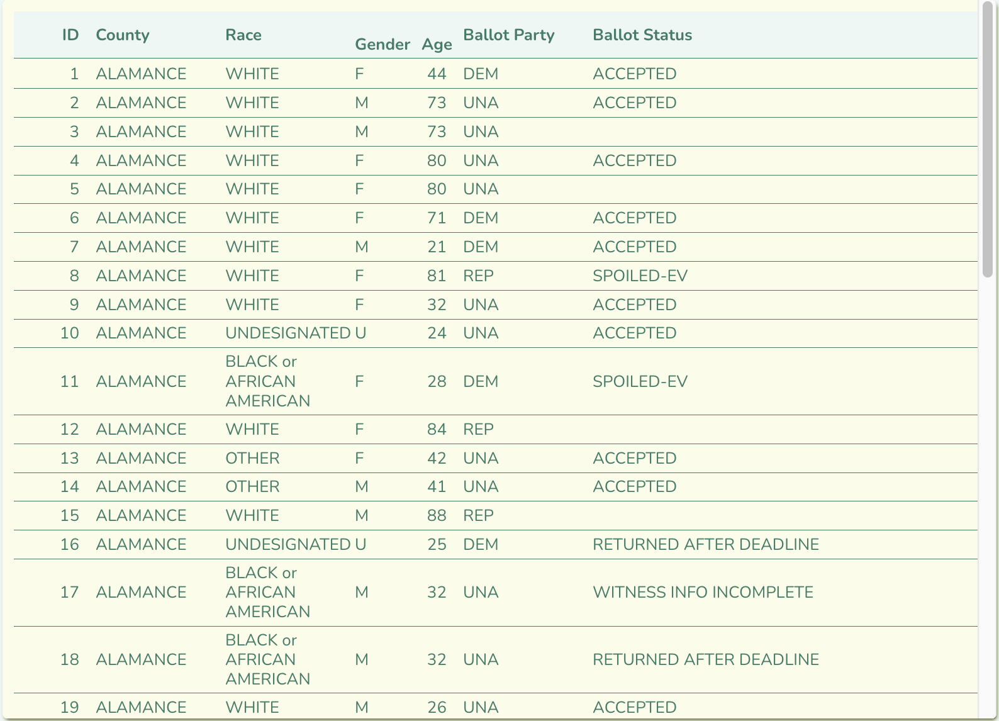

# 2.3-Creating Groups & Frequency Distributions

```js
import {utcParse,utcFormat} from "d3-time-format";
```

## Start Your GH Workflow

Remember, before you start anything else, always follow this GH methodological workflow:

1. Create meaningful **branch** that uses the agreed upon naming scheme: `CHP/X.x--name_of_chp`.
2. Practice the iterative process to **commit** and **push** regularly with meaningful **commit messages**.

## Overview

In this chapter, we are going to learn about descriptive statistics related to frequencies and distributions of  the data. Descriptive statistics is essential to any data-driven work, because its a suite of techniques that will help you "read" and interpret large datasets. Indeed, we need to learn how to more quickly understand thousands and thousands of rows of information with sometimes dozens of features/columns. Descriptive statistics is one suite of tools to do this work.

We are going to follow a different case than the social worker, June, in *Statistics for Social Justice*. We are going to continue working with the 2024 NC absentee voter data.

## Learning Objectives

We're going to practice the following skills:

- **Statistics**:
  1. Understand **descriptive statistics**, **variables**, *values*, and *arrays*.
  2. Understand and learn how to compute 2 types of frequency distributions:
      1. Absolute
      2. Grouped
- **JavaScript**:
  1. Practice variable assignments, loops, conditions and functions in JS.
  2. Practice fetching, i.e., "attaching" data sets with `FileAttachment()`.
  3. Learn and practice the "RFS method" to compute the 2 of the 4 types of frequency distributions with JS/D3.
      <p class="note">We will learn percentages in the extended 2.2 exercise.</p>
  4. Practice importing custom local functions to use in our notebooks.

## Readings

I recommend reading the S4SJ book alongside the completion of coding exercises in this OF notebook. You can read and reference the appropriate documentation, when completing pertinent code exercises. Indeed, the Observable & D3.js documentation readings are going to be important to review and have available for reference to complete this chapter's follow-along exercises.

1. ***Statistics for Social Justice***. Chapter 3 - "Frequency distributions and graphs" (pp. 25-44).
    <p class="note">Skip the graphing sections. We'll learn those techniques in 2.3.</p>
2. **Observable's Documentation**: Skim to understand & bookmark for quick referencing.
    1. Framework's "[Table input](https://observablehq.com/framework/inputs/table)"
3. **D3's Documentation**: Bookmark for quick referencing.
    1. [Grouping data](https://d3js.org/d3-array/group#rollups) with `.rollups()`.
    2. [Summarize data](https://d3js.org/d3-array/summarize#sum) with `.sum()`.
4. **MDN Javascript Guide**: Skim and bookmark for quick referencing:
    1. [Flatten nested arrays](https://developer.mozilla.org/en-US/docs/Web/JavaScript/Reference/Global_Objects/Array/flatMap) with `.flatMap()`

## 2.3.1 Attach the data set

Ok, let's attach and review the data with Observable's `FileAttachment()` and `Inputs.table()`.

Again, we are going to continue working with the 2024 NC absentee voter CSV file, `nc_absentee_mail_2024.csv`, which is located in `data` > `nc-voters`.

## E1. Attach the data

1. Convert the below codeblocks to executable `js` codeblocks.
2. Assign the data to a variable named `ncVotersAll`.
3. Render it to the page in a separate codeblock.

```javascript
// FileAttachment() code here assigned to `ncVotersAll`
```

Output the data as an interactive array of objects below:

<p class="codeblock-caption">
  Interactive output of full data set in <code>ncVotersAll</code>
</p>

```javascript
// Convert to render on page
ncVotersAll
```

## 2.3.2 Review the data as a table

We will be learning how to "read" large data sets with exploratory data analysis techniques, which include multiple visualizations. But, first, we shouldn't neglect to learn the simple table!

Observable has a suite of modules called **Inputs**. We're going to learn how to use [Observable's Inputs.table()](https://observablehq.com/framework/inputs/table) method to render the attached data as a table. In its most basic form, it expects a flat array of objects with properties, which is what `FileAttachment()` renders for us.

```javascript
// Most basic Inputs.table()
Inputs.table(ncVotersAll)
```

Notice how the table "lazily" loads data as you scroll down the data, so your browser doesn't explode!

## E2. Add custom features for `Inputs.table()`

Ok, that's easy, but that's way too much data for a table!

Let's create a new table below that reduces what we want to see by implementing the following options within a second parameter, which is an object `{...}` with the following properties:

- `columns`: Reduce the 17 columns to the following seven columns. Remember that you can access them via `data.columns`.
    ```javascript
    columns: [
      "id_num", "county_desc", "race", "gender", "age",
      "ballot_request_party", "ballot_rtn_status"
    ]
    ```
- `rows`: Default is 11.5. Let's change it to 25:
    ```javascript
    rows: 25
    ```
- `width`: Since some values in the table are short in length than others, let's define specific column widths. We can use an object where each provided column name is a key and value the desired width in pixels (px):
    ```javascript
    width: {
      id_num: 20,
      county_desc: 90,
      gender: 40,
      age: 20,
      race: 90,
      ballot_request_party: 90,
    }
    ```
- `header`: We can also rename the column names in the header. Use the desired original column names as keys in an object, where the values are new Strings to rename that column:
    ```javascript
    header: {
      id_num: "ID",
      county_desc: "County",
      race: "Race",
      gender: "Gender",
      age: "Age",
      ballot_request_party: "Ballot Party",
      ballot_rtn_status: "Ballot Status",
    }
    ```

Ok, now I want you to put all of those pieces together in your own `Inputs.table()` with the NC absentee voter data. Here's what it should look like:



```javascript
// Insert your table here
Inputs.table(
  // The array of objects
  ncVotersAll,
  {
    // enter each customizing property in this object
  }
)
```

## E3. Case Scenario & Data Provenance

To be honest, we should never really drop that much data into a table. Nobody wants or needs to review so much data at once. Typically, we should reserve tables for smaller amounts of data for ourselves and our audience to review and comprehend. Let's learn how to compute and apply ***frequency distributions***, so we can reduce the data into a more meaningful set to tabulate.

Also, as we move through this section of the book, we need to cultivate a critical awareness about how numbers, calculation, and other data types are never removed from the context of their collection and use. For this reason, we will be learning about data and statistical work with a wholistic socially just approach in mind. To help us accomplish this aim, we will be using a running scenario that involves working with the 2024 North Carolina general election data for absentee ballots. We will specifically take on the following scenario and role as a communicator working at a nonprofit called **Protect Democracy**:

> You work for a nonpartisan, nonprofit called **Protect Democracy** (PD) as an analyst and writer. One of PD's missions is to ensure free an fair elections. They want to run a series of stories about mail-in voting, and they recalled how, during the 2020 election, NC had racial disparity with regards to whose ballots were being rejected ([See 538 story](https://fivethirtyeight.com/features/north-carolina-is-already-rejecting-black-voters-mail-in-ballots-more-often-than-white-voters/)). Consequently, they want you to look into any potential rejected ballot issues that might have occurred for mail-in voters in NC during the 2024 election.

### About the NC absentee voter ballot data, and its provenance

Before we move forward, it's a good idea to understand the data with any available external resources to uderstand its provenance. ***Provenance*** is essentially understanding the original context of people, places, intentions, and definitions of the dataset.

Perhaps many of us, myself included, were not immediately knowledgable about this subject or process of voting via mail. Here are a couple of primer points that I have learned through some initial reading of the archived 2024 version of NC's website about mail-in/absentee voting ([see ncsbe.gov on archive.org](https://web.archive.org/web/20240108154755/https://www.ncsbe.gov/voting/vote-mail)):

- The due date to request a ballot is by 5PM the Tuesday before the election.
- Voters can request a mail-in/absentee ballot either online or by filling out a form and returning it in the mail.
- Online requests were available to make by January 3rd, 2024.

To learn more about the dataset itself, you can start with the provided README file, which the state provides as a means of explaining the data types in the set: `/src/data/nc-voters/provenance/nc_absentee_readme.txt`.

Finally, inside of the `/src/data/nc-voters/provenance/` folder, you can also review the PDF forms voters must use to request a mail-in/absentee ballot--I've included a range of different versions between 2020 and 2024.

**Question**: After reviewing the above information, how would a SJ ethic inform your intiial understanding of the data, its collected values, and its context? List out in other information or questions that you sense might be missing about the data.

ENTER_YOUR_RESPONSE_HERE

**Question**: Based on the case scenario as a communicator at Protect Democracy, and a SJ ethic in mind, what questions, i.e., angles, do you think may be helpful to meet the needs of your situation. Discuss any columns/fields that you are surprised about or spark any curiosities, and create a list of questions they spark in you.

ENTER_YOUR_RESPONSE_HERE

**Question**: What can you understand about the `ballot_rtn_status` column? In other words, what types of values are possible?

ENTER_YOUR_RESPONSE_HERE

## 2.3.4 Calculate Absolute Grouped Frequencies with RFS Method

Alright, even though you read through some contextual information about the dataset, numerous questions remain unknown to us, since we don't know what values are represented in the data or their distribution. In short, we need a way to "read" the data. Indeed, we will need to learn a slightly new way to aggregate our data and calculate the absolute frequency of rejected, or not accepted, voter ballots per race category in a format that works with the `Inputs.table()` method.

Enter the **RFS method**: ***.rollups() -> flatMap() -> .sum()*** procedure! The RFS method uses a specific series of versatile functions that create a great go-to method for simple descriptive statistics work.

Firstly, we will learn how the RFS method uses D3's `.rollups()`, which is just like the regular `.rollup()` that we learned in chapter 1.9. However, `.rollups()` does not return an `InternMap`. Instead, `.rollups()` creates a nested version of the ***key->mapped entries*** nodes as an Array of Arrays like the following pattern:

<!-- Example generic output from rollups() -->
```javascript
// Example 1-Level InternMap transformed as Array of nested Arrays
[
  ["key1L1", Number],
  ["key2L1", Number],
  ["key3L1", Number],
  //more entries...
]

// Example 2-Level InternMap transformed as Array of nested Arrays
[
  [
    "key1L1", [
      ["key1L2", Number],
      ["key1L2", Number],
      //more L2 entries for key1L1 ...
    ]
  ],
  [
    "key2L1", [
      ["key2L2", Number],
      ["key2L2", Number],
      //more L2 entries for key2L1 ...
    ]
  ],
  //more L1 entries...
]

// And so on, based on the number of levels rolled up
```

The hierarchical parent-child node values in each array are positioned carefully in the hierarchical sequence defined in our `.rollups()` method. However, the last value in hierarchies of arrays, i.e., the *leaf-node array*, is assumed as the entry values to perform some computation on, such as simple addition.

In our case with the voter data, the computed value is the ***absolute frequency*** of voters' ballot return status (`ballot_rtn_status`), which is grouped by their race (`race`). The resulting array of arrays will look like the following pattern:

<!-- Example output from .rollups() -->
```javascript
[
  [
    "ASIAN",
    [
      ["ACCEPTED", 8441],
      ["SPOILED-EV", 2260],
      ... // More per ballot_rtn_status
    ],
  ],
  [
    "TWO or MORE RACES",
    [
      ["ACCEPTED", 1484],
      ["SPOILED-EV", 340],
      ... // More per ballot_rtn_status
    ],
  ],
  ... // More per race
]
```

## 2.3.5 RFS 1. Roll it up with .rollups()!

Ok, so we want to create a desired ***grouping*** of `ballot_rtn_status` > `race` with their respective absolute frequencies with `.rollups()`. Here's how we produce the above output with our attached `ncVotersAll` data.

1. Assign the output of d3.rollups() to a variable. We'll use the desired output as a guide for the name: `afStatusByRace`.
2. Within d3.rollups(), add our parameters separated by commas:
    1. Add first param: our array of objects: `ncVotersAll`.
    2. Add second param: the computation to perform on the rolled up data. In this case, we want the absolute frequency of ballot statuses per race.

<!-- Example rollups() -->
```javascript
/**
 * .rollups()
 * @return: a flattened version of InternMap:
 *   [ ["key", [entries as objects]], ... ]
**/
const afStatusByRace = d3.rollups(
  ncVotersAll,
  v => v.length, // length of leaf node: ballot_rtn_status
  d => d.race,
    d => d.ballot_rtn_status
)
```

<p class="codeblock-caption">
  Interactive output of rolled up <code>afStatusByRace</code>:
</p>

<!-- afStatusByRace output -->
```javascript
// Convert to render on page
afStatusByRace
```

## 2.3.6 RFS 2. Flatten that `.rollups()` output with `.flatMap()`

Rollups is great at quickly grouping flat data, such as an array of objects, by rolling it up per group and subsequently performing computations on each grouping. However, a set of nested arrays can be very hard to work with in code, because this output, which resembles an InternMap() in hierarchy, does not include helpful keys to self-document our code as we need access to different rolled up levels and entries.

To remedy the above issue, we can *flatten our nested hierarchies of arrays* assigned to `afStatusByRace`. By flattening the rolledup groups, again, we can reassign the object key-value pairs, which will help us later when we need to reduce the data to either ACCEPTED or REJECTED statuses. Indeed, we will consistently be reminded how when we work with data in JS, Observable, and D3 that we need our data to be a "flat" array with objects:

```javascript

[{...},{...},{...}, ...]

```

### What's `.flatMap()`?

We can flatten them with a helpful built-in JS method called [`.flatMap()`](https://developer.mozilla.org/en-US/docs/Web/JavaScript/Reference/Global_Objects/Array/flatMap).

According to MDN, .flatMap() takes an array with nested arrays as items. returns a new array formed by applying a given callback function to each element of the array, which then flattens the result ***by one level***.

`.flatMap()` actually combines two operations that were commonly done in conjunction: `.map()` and `.flat()`. We've used .map() before. The .flat() method is simple: It flattens any nested levels of arrays contained by another array like the cases below.

### How `.flat()` works

Let's first look at how `.flat()` works, so you can see how this process will help us eventually flatten nested Arrays from `.rollups()`.

Note how it nicely does what it says: takes any array at a particular nested level, iterates through it, and populates them in-place.

```javascript
// Convert if you want to see the logs in your own browser
const arr1 = [0, 1, 2, [3, 4]]

console.log("Original arr1", arr1)
console.log("flatten arr1", arr1.flat())
// expected output: [0, 1, 2, 3, 4]

const arr2 = [0, 1, [2, [3, [4, 5]]]]

console.log("Original arr2", arr2)
console.log("flatten arr2", arr2.flat())
// expected output: [0, 1, 2, [3, [4, 5]]]

console.log("flatten arr2 TWO TIMES", arr2.flat(2))
// expected output: Array [0, 1, 2, 3, [4, 5]]

console.log("flatten arr2 INFINITY", arr2.flat(Infinity))
// expected output: Array [0, 1, 2, 3, 4, 5]
```

The `.flatMap()` function merely adds the functionality of .map(), so we can access and perform a process on each item as we conduct the flattening process. This process will be helpful to learn, since it helps us iterate across all of the items in a grouped level created by using D3's `.rollups()` function. In the following 3 videos, I review how to jointly use D3's `.rollups()` and JS' `.flatMap()` for two different scenarios:

1. If you may need to flatten a simple **one-level** grouped hierarchy of data, and
2. If you need to flatten a **two-level** grouped hierarchy of data.

By reviewing these two scenarios, you should be able to discern how you can handle future situations where you need to rollup and flatten data with nested in more then two levels/groups.

Open up the `./utils/utils.js` file, so you can review the code as you watch the videos.

<p class="figure-caption">
  1. Introduction to D3's .rollups, JS' .flatMap, and D3's .sum method
</p>

In this video, I outline the overall purpose and process of this method.

<video controls style="width: 620px; height:620px">
  <source src="./../assets/vids/02-why-stats/02-rollups-flatMap-sumup-1-intro.mp4" type="video/mp4" />
</video>

<p class="figure-caption">
  2. Use .rollups & .flatMap with one level
</p>

In this second video, I explain the code inside of the custom `oneLevelRollUpFlatMap()` function.

<video controls style="width: 620px; height:620px">
  <source src="./../assets/vids/02-why-stats/02-rollups-flatMap-sumup-2-oneLevel.mp4" type="video/mp4" />
</video>

## E4. Import and use `oneLevelRollUpFlatMap()` on `ncVotersAll`

Ok, now that you have watched the above video about the `oneLevelRollUpFlatMap()` function. Import it from the `./utils/utils.js` file in the codeblock below.

```javascript
// Convert me and import oneLevelRollUpFlatMap()
import {PUT_ANY_FUNCTIONS_IN_HERE, SEPARATE_MORE_THAN_ONE, WITH_COMMAS} from "enter/path/here.js"

```

Now, see if it worked!

Use the imported function in the below codeblock to rollup and flatten `ncVotersAll` by (1) `race` and (2) `ballot_rtn_status`.

```javascript
// Convert and use `oneLevelRollUpFlatMap()` on `ncVotersAll`
const byRaceAndBallotStatus = ADD_FUNCTION_HERE
```

Ok, let's see if `byRaceAndBallotStatus` shows up here by rendering it to the page.

```javascript
byRaceAndBallotStatus
```

<div class="error-caption">
  <p>If you receive an error, consider the following tips:</p>
  <ul>
    <li>Comment out the last few lines of code, so you can troubleshoot the problem;
    <li>Did you add the correct parameters in the correct sequence?
    <li>You may also need to kill and restart the localhost server, when importing modules from local files. This isn't always the case, but I have experienced this issue before myself.
  </ul>
</div>

## E5. Create a new one level grouping

Ok, now you try this custom function with a different variable from the dataset.

```javascript
// Convert and create your own one-level grouping
```

```javascript
// Convert and output your variable here
```

## E6. Import and use `twoLevelRollUpFlatMap()` on `ncVotersAll`

If your code worked at one level, let's learn how to perform the same operations across two levels.

<p class="figure-caption">
  3. Use .rollups & .flatMap with two levels
</p>

In this video, follow along as I explain the code for the `twoLevelRollUpFlatMap()` function.

<video controls style="width: 620px; height:620px">
  <source src="./../assets/vids/02-why-stats/02-rollups-flatMap-sumup-3-twoLevel.mp4" type="video/mp4" />
</video>

After you have watched the above video, it is time for you to try this custom function with the two example variables used in the our running angle.

```javascript
// Convert and create your own two-level grouping
```

```javascript
// Convert and output your variable here
```

## 2.3.7 RFS 3. Sum it up with D3's .sum()!

Let's learn and use D3's `.sum()`, because, while `.length()` worked for us to get the total of each instance in an array by finding its length, `d3.sum()` will help us do some more helpful and customizable `Number` work with addition.

Indeed, sometimes, we will need to access properties in an object with the `Number` that we wish to tally within a collection, so `d3.sum()` enables us to iterate through a collection and access properties to find the sum total of that targeted property.

Here's the easiest way to use d3.sum(). The first parameter is required, which is any type of iterable. Since you do not need to explicitly define how to access the Number values in a simple array, like the example below, `d3.sum()` has been programmed to assume it is a simple array and sum it up.

```javascript
// d3.sum(iterable, accessor) // 10
d3.sum([1, 2, 2, 2, NaN, 3, null]) // 10
```

<p class="note">
  Note how any <code>null</code> or "Not A Number" (<code>NaN</code>) values are ignored automatically.
</p>

Ok, but what about our typical ***array of objects***? Well, accessors to the rescue! The second optional parameter for `d3.sum()` is an accessor function, which tells `d3.sum()` which object property to access and iteratively add to the total.

In the example below, our iterable is an array of objects, `fruitCollection`, wherein we have 2 properties: total of `apples` and `oranges`. If we wish to find the sum of all of the `apples` in `fruitCollection`, we pass `fruitCollection` as the iterable, then use the `apples` property key in the accessor function. Then, `d3.sum()` does the rest for us!

<!-- Example of d3.sum() & fruitCollection -->
```javascript
const fruitCollection = [
  {apples: 20, oranges: 0},
  {apples: 10, oranges: 50},
  {apples: 0,  oranges: 60},
  {apples: 40, oranges: 20},
  {apples: 30, oranges: 30},
]

const simpleApplesSum = d3.sum(
  // Iterable
  fruitCollection,
  /**
   * Accessor with use of
   * parentheses to wrap
   * simplified arrow function.
  **/
  ((d) => d.apples)
)

// Result: simpleApplesSum == 100

// Alternative accessor approach
const altApplesSum = d3.sum(
  // Iterable
  fruitCollection,
  /**
   * Accessor as function to include
   * more dynamic options like conditions.
   * Note the `return` statement is necessary.
  **/
  (d) => {
    if (d.oranges < 50) { return d.apples }
  }
)

// Result: altApplesSum == 50
```

## E7. Use Custom Sum Up with Your Running Case

Alright, now that we have a more robust method to summarize the data with `d3.sum()`, let's see it in action within our running scenario at Protect Democracy.

Below, we continue our running angle of finding the frequency distribution of ballot statuses per race in the 2024 NC election data. Remember that we need to count the *absolute frequency* of ***all ACCEPTED*** ballots per race and ***all REJECTED*** ballots per race. The issue is that there are 2 status values for `"ACCEPTED"` values, `null` values to filter out, and all other values can be considered `"REJECTED"`.

Follow along with me in the video below to learn how to create a custom function that can adapt to different counting 2-level groupings with different methods to reduce the data.

<p class="figure-caption">
  Create a custom function to reduce and sum up the data, e.g., akin to, or the same as, either <code>"ACCEPTED"</code> or <code>"REJECTED"</code> frequencies per grouping.
</p>

<video controls style="width: 620px; height:620px">
  <source src="./../assets/vids/02-why-stats/02-sumUpWithReducerTests-1-twoLevel.mp4" type="video/mp4" />
</video>

<!-- Your Reducer Functions -->
```javascript
// Convert and create your own reducer functions akin to "ACCEPTED" vs "REJECTED"
```

<!-- Call and use sumUpWithReducerTests() -->
```javascript
/**
 * Convert and use sumUpWithReducerTests().
 * Be sure to review the utils.js file, so you
 * can see the parameters needed for the function.
**/
```

<p class="codeblock-caption">
  Interactive output of using sumUpWithReducerTests().
</p>

<!-- Your Reducer Functions -->
```javascript
// Convert and output your summed up data
```

## E8. Tabulated absolute frequencies of rejected ballots per race

Ok, tabulate the rolledup and summed-up results with `Inputs.table()`. Be sure to also complete the following customizations to your table:

1. Rename the columns to names that are more helpful, such as `"Voter's Race"`, `"Total Absentee Ballots"`, and `"Total Rejected Absentee Ballots"`.
2. Adjust the `width` and alignment (`align`) properties of the columns.
3. Sort the table based on what you deem the most helpful combo of column and ascending vs. descending.
4. Be sure to provide a short response to the question about your table design.

```javascript
// Enter your table here
```

### Question: Explain your table design choices.

**Q**: What *insights* and *new questions* did you garner from it that you hope to also illustrate/provide for your audience?

ENTER_YOUR_RESPONSE_HERE

## Conclusion

Alright, you've accomplished a lot!

Now, it's time to complete the extended exercise for this chapter on the next page. You will be asked to build on your knowledge of grouping and counting data by 1 and 2 groups by writing code that performs the RFS method with ***3 groups***.

## Submission

1. Create a **PR** (**pull request**) and use the provided content in the template to start it.
2. Respond to your peers and comment on their work too.
3. Submit the PR link in Moodle, when you're ready.
