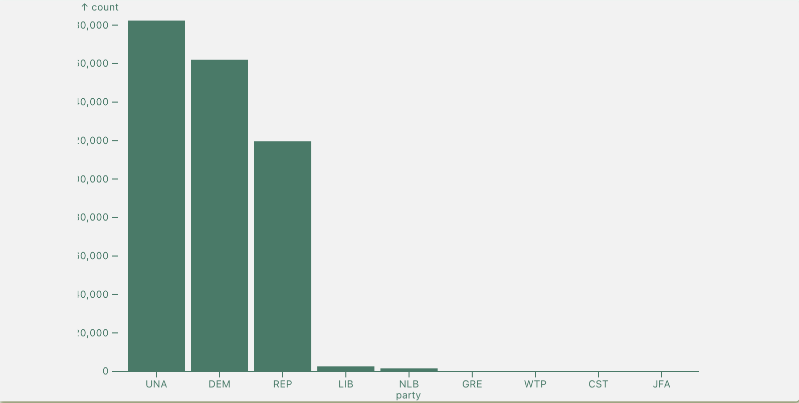
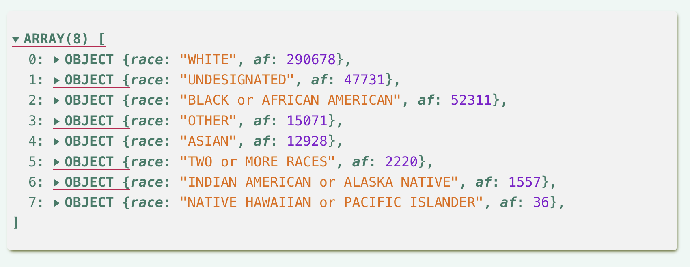
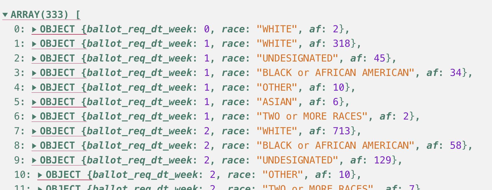
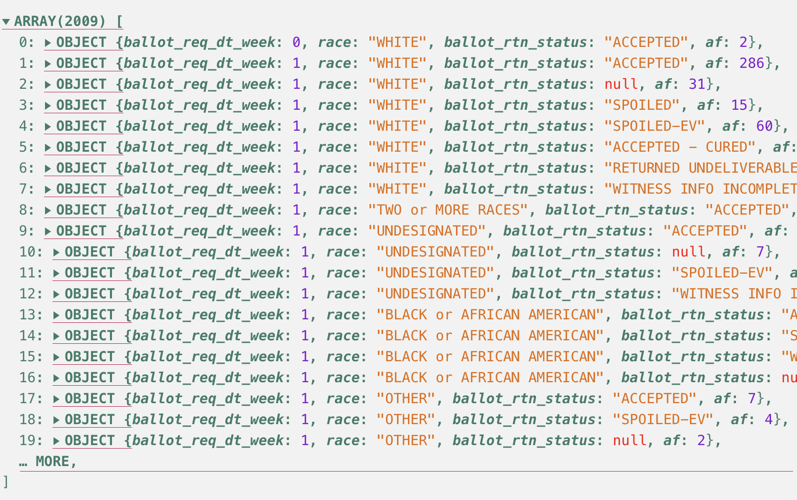
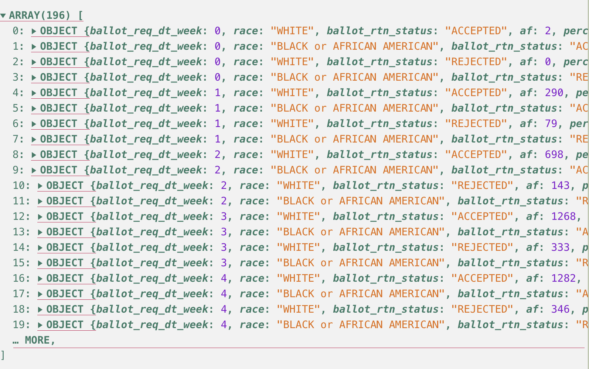
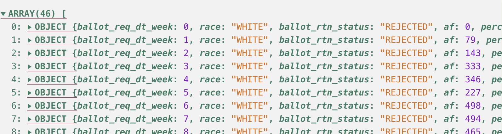

# 2.4-Plotting Frequency Distributions

```js
import {utcParse, utcFormat} from "d3-time-format";
import {oneLevelRollUpFlatMap, twoLevelRollUpFlatMap, threeLevelRollUpFlatMap, mapDateObject, getUniquePropListBy} from "./utils/utils.js"

```

## Start Your GH Workflow

Remember, before you start anything else, always follow this GH methodological workflow:

1. Create meaningful **branch** that uses the agreed upon naming scheme: `CHP/X.x--lastname`.
2. Practice the iterative process to **commit** and **push** regularly with meaningful **commit messages**.

## Overview

Recall how our table result at the end of the [last chapter (2.3)](./03-freq-dist-EDA.html#e5-tabulate-af-grouped-perc-results) still had too much information to parse. While it may help us examine and understand the data better than before we *rolled and summed it up*, we are going to learn how to take a few more steps to slice up the data even more to yield more interesting results to examine and potentially communicate.

Specifically, we'll learn how to filter the data to slice the data up even more to pursue new angles. For example, we'll review the two largest racial groups represented in the data: `"WHITE"` and `"BLACK or AFRICAN AMERICAN"`.From there, we will learn how to visualize frequency distributions of the data. Visualizing data will help us understand and find patterns more easily than if we were constrained to tables alone.

## Learning Objectives

We're going to practice the following skills:

- **Statistics**:
  1. Understand multiple types of charts and their use cases with particular types of data:
      1. Bar with nominal
      2. Histogram with interval/ratio
      3. Line with interval/ratio
- **JavaScript**:
  1. Practice fetching, i.e., "attaching" data sets with `FileAttachment()`.
  3. Practice using importable custom functions.
  4. Code the 3 types of charts with Observable's Plot.

## Readings

Read the remainder of S4SJ's chapter 3, as well as a shorter article about a few ways people create visual arguments with charts.

I have provided links to helpful and appropriate documentation, which will prove useful when completing pertinent code exercises.

1. ***Statistics for Social Justice***. Chapter 3 - "Frequency distributions and graphs" (pp. 25-44).
    <p class="note">Focus on the graphing sections.</p>
2. Lindgren, C. (2021). Facts Upon Delivery: What Is Rhetorical About Visualized Models? *Journal of Business and Technical Communication*, *35*(1), 65–72. [https://doi.org/10.1177/1050651920958499](https://doi.org/10.1177/1050651920958499).
3. **Observable Plot's Docs**: Read "What is Plot?", but feel free to skim to understand & bookmark the others for quick referencing.
    1. "[What is Plot?](https://observablehq.com/plot/what-is-plot)"
    2. "[Plots](https://observablehq.com/plot/features/plots)"
    3. "[Tip Marks](https://observablehq.com/plot/marks/tip)"
        <p class="note">
          Focus on the first two examples as helpful references for now.
        </p>
    4. ***Important Resource!*** [Observable's Plot reference cheatsheet](./../assets/readings/02-why-stats/plot-cheatsheets.pdf)
        <p class="note">
          I recommend downloading the above Plot cheatsheet for easier referencing.
        </p>
4. **D3's Documentation**: Review for quick referencing.
    1. [Filtering data](https://d3js.org/d3-array/transform#filter) with `.filter()`.
    2. Review: [Grouping data](https://d3js.org/d3-array/group#rollups) with `.rollups()`.
    3. Review: [Summarize data](https://d3js.org/d3-array/summarize#sum) with `.sum()`.
5. JavaScript's .sort() method. See [MDN's JS Reference and examples](https://developer.mozilla.org/en-US/docs/Web/JavaScript/Reference/Global_Objects/Array/sort).

## 2.4.1. Learning the Basics of Observable Plot

In the video below, I review the essential parameters necessary for rendering a chart with your ***data (an Array of objects)*** and ***Observable's `Plot.plot()` function***.

<p class="figure-caption">
  Overview of <code>Plot.plot({...})</code> basics
</p>

<video id="plot_basics" controls preload="auto" style="width: 620px; height:620px">
  <source src="../assets/vids/02-why-stats/04-plot-basics.webm" type="video/webm" />
  <source src="../assets/vids/02-why-stats/04-plot-basics.mp4" type="video/mp4" />
  <p>
    Your browser doesn't support HTML video. Here is a
    <a href="../assets/vids/02-why-stats/04-plot-basics.mp4" download="../assets/vids/02-why-stats/04-plot-basics.mp4">link to the video</a> instead.
  </p>
</video>

<p class="codeblock-caption">
  Example <code>Plot.plot({...})</code> code plotting a simple bar chart of nominal data.
</p>

<!-- Illustrative code -->
```javascript
/** 1. Call the Plot class object with the .plot function
 *     -- Note an object {} is the .plot() parameter
**/
Plot.plot({
  /** 2. Add `marks`, which should be an Array
   *     - See the cheatsheet for its numerous
   *       available options
  **/
  marks: [
    /** 3. Add `n` number of chart types
     *     -- Here, we use Plot.barY()
    **/
    Plot.barY(
      // 3.1 Array of objects
      flatParties,
      // 3.2 Object with at least x & y
      {
        x: "party",
        y: "count",
        // Optional descending sort option
        sort: {x: "-y"}
      }
    )
  ]
})
```

<p class="figure-caption">
  Example chart from the above code.
</p>



Ok, now that you know the basics of Plot, let's learn how to create some charts! But, before we can do so, let's practice attaching the NC absentee ballot data.

## E1. Attach the data set

Ok, let's attach and review the data with Observable's `FileAttachment()` and make sure everything looks ok by rendering it to the page.

Again, we are going to continue working with the 2024 NC absentee voter CSV file, `nc_absentee_mail_2024.csv`, which is located in `data` > `nc-voters`.

1. Convert the below codeblocks to executable `js` codeblocks.
2. Assign the data to a variable named `ncVotersAll`.
3. Render it to the page in a separate codeblock.

```js
let ncVotersAll = FileAttachment("../data/nc-voters/nc_absentee_mail_2024.csv").csv({typed: true})
```

<p class="codeblock-caption">
  Interactive output of full data set.
</p>

```js
// Convert if you want to print the data to the page
ncVotersAll
```

## E2. Translate String Date Data into Date() Objects

Let's use our helpful `mapDateObject()` function in the `utils.js` file, so we can easily create Date() objects and new date fields, such as week numbers.

<!-- Create date objects and new date props -->
```js
const ncUpdates = mapDateObject(ncVotersAll, "ballot_req_dt")
/**
 * Use the mapDateObject() function below
 * and assign the returned data to a new
 * constant called `ncUpdates`
**/

```

<p class="codeblock-caption">
  Interactive output of full data set.
</p>

```js
// Convert if you want to print the data to the page
ncUpdates
```

## E3. Apply Multiple Rollups & FlatMap on *ncUpdates*

Alright, let's use our custom utility functions to create some data to plot. Continuing our work from the previous chapter 2.2, let's create the following two arrays of objects:

1. Use `oneLevelRollUpFlatMap()` to get the absolute frequencies of each `"race"` in `ncUpdates`. Assign the returned array of objects to the constant variable called `afByRace`, i.e., *absolute frequencies by race*.
    <div class="example code-output">
      
    </div>
2. Use `twoLevelRollUpFlatMap()` to get the absolute frequencies of the 2-level group of `ballot_req_dt_week` > `race` in `ncUpdates`. Assign the returned array of objects to the constant variable called `afByWeekAndRace`, i.e., *absolute frequencies by week and race*.
    <div class="example code-output">
      
    </div>
    <p class="note">We're also going to sort this data after we roll it up and flatten it.</p>

<!-- Use the custom functions here -->
```js
const afByRace = oneLevelRollUpFlatMap(ncUpdates, "race", "af")
const afByWeekAndRace = twoLevelRollUpFlatMap(ncUpdates, "ballot_req_dt_week", "race", "af")
// Convert and create the data described above

```

<p class="codeblock-caption">
  Feel free to use the codeblock below to check your outputs.
</p>

```js
afByRace
// Convert check outputs: afByRace & afByWeekAndRace

```
```js
afByWeekAndRace
```

## E4. Sort *afByWeekAndRace* with *.sort()*

Our data should represent its phenomena, which sometimes includes how it is sorted. In the case of `afByWeekAndRace`, the data are temporal, so we should make sure that the transformed data represent a linear, chronological sequence -- even if all of us Dr. Who fans know that time is "wibbly wobbly". `;-)`

Now, it may be that the data are already still sorted in this way, but sometimes JS or other code libraries' methods and functions may not procedurally manage and output your data the same way you input it, so it is helpful to be aware of the sort method.

JS has the built-in `sort()` method, which takes a function/accessor as a parameter. Then, the arrow function needs these three parts:

1. `(a,b)` Pass 2 items in the iterable to compare.
2. `=>` The arrow function syntax
3. Code that does organizes the data.
    - In this case, we can use D3's `ascending()` function, which accepts two parameters: the 2 items to compare. Since we're comparing two objects, we need to specify which keys to compare with `a` & `b`.

```js
// How to use JS' .sort() method with D3's ascending or descending functions.
const afByWeekAndRaceSorted = afByWeekAndRace.sort(
  // sort() takes a function/accessor as a parameter.
  (a,b) => d3.ascending(a.ballot_req_dt_week, b.ballot_req_dt_week)
)
```

<p class="codeblock-caption">
  Output of the sorted data: <code>afByWeekAndRaceSorted</code>.
</p>

```js
afByWeekAndRaceSorted

```

## E5. Bar Chart: Plotting Absolute Frequencies

**Goal**: Use `Plot.plot()` and its `marks` option of `.barY()` to plot `afByRace`. This plot will display computed absolute frequencies of the nominal (categorical) column of `race` in the NC mail-in dataset.

<p class="tip">
  I highly recommend that you open the <strong>plot-cheatsheets.pdf</strong> file in the <code>/src/assets/readings/02-why-stats</code> folder.
</p>

1. **Create a parent `Plot.plot()` layout and add the following options**:
    1. Add a `grid`
    2. Adjust `marginLeft`, `marginBottom`, and `marginTop` to make sure the labels fit.
    3. Change the labels for the `x` x-axis to "Race" and the `y` y-axis to `"Absolute Frequency"`
2. **After the above options for the parent `Plot.plot()` layout, note the `marks` option whose value is an Array.**
3. **Inside of `marks`, add the following options**:
    1. Draw a rule line for the x-axis with:
        ```javascript
        Plot.ruleY([0]),
        ```
    2. Make the column category names legible by adding the following adjustment to the x-axis labels:
        ```javascript
        Plot.axisX({label: null, lineWidth: 8, marginBottom: 40}),
        ```
3. Still inside of `marks`, tell Observable to start drawing your bars with `Plot.barY()`
    1. Inside of the `barY()` function, add the `afByRace` data as the first parameter.
    2. After the data parameter, add an object `{}` as the second parameter. Remeber that this object's properties tell Observable how to customize the `barY()` chart.
        1. Inside of the object of options, add the following options:
            1. Declare as Strings which properties/columns to apply to the `x` and `y` axes. ***Be sure to separate them by commas.***
            2. Sort the data with `sort`, and do so in a descending order with the following line: `sort: {x: "-y"},`
            3. Tell Plot to add a tooltip for each bar by writing: `tip: true`
            4. Add spaces inbetween each bar by adding a Number value of `10` to 2 final options: `insetRight` and `insetLeft`.

<p class="figure-caption">
  Final output of the code described in the above procedure.
</p>

<video controls style="width: 620px; height:620px">
  <source src="../assets/vids/02-why-stats/04-first-plot-output.mp4" type="video/mp4" />
  <p>
    Your browser doesn't support HTML video. Here is a
    <a href="../assets/vids/02-why-stats/04-first-plot-output.mp4" download="../assets/vids/02-why-stats/04-first-plot-output.mp4">link to the video</a> instead.
  </p>
</video>

### Plot `afByRace` with `.barY()`

I've supplied you with the skeleton for this plot. Be sure to add the options noted in the directions above.

```js
Plot.plot({
  grid: true,
  x: {label: "Race:"},
  y: {label: "# of Absentee Ballots:"},
  // 1. Add comma-separated layout options
  marks: [
    // 2. Add comma-separated marks options
    
    // 3. Create your bar chart
    Plot.ruleY([0]),
    Plot.barY(
      afByRace,
      {
        x: "race",
        y: "af",
        sort: {x: "-y"},
        insetRight: 10,
        insetLeft: 10,
        tip: true,
        marginLeft: 50,
      
      }
    ),
    Plot.axisX(
      {
        label: "Race",
        lineWidth: 8,
        marginBottom: 50,
        
      }
    ),
    Plot.axisY(
      {
        label: "Total # of Absentee Ballots",
      }
    )
  ]
})
```

## E6. Histograms: Plotting interval/ratio data with *Plot.rectY()*

**Goal**: Histograms are excellent for seeing the distribution of intervals or ratios. For this exercise, plot the distribution of *absolute frequencies of ballots requested each month*.

To create the plot that you have the `oneLevelRollUpFlatMap()` function at your fingertips, as well as the new date property field for the month number, `ballot_req_dt_month`, which you should have created with `mapDateObject()` before this part of the notebook.

```js
/**
 * Use oneLevelRollUpFlatMap() to count the
 * absolute frequencies (AF) of `ballot_req_dt_month`.
 * Name the AF property `af`.
**/
const monthlyBallotRequests = oneLevelRollUpFlatMap(ncUpdates, "ballot_req_dt_month", "af")
```
```js
monthlyBallotRequests
```

Let's plot it as a histogram!

1. Create your layout with `Plot.plot({})`
  ```javascript
  Plot.plot({
    // Options will go in here
  })
  ```
2. Our frequency numbers on the y-axis will need some margins to fit in our layout box, so add margins to the layout on the left side with `marginLeft: 60,`.
3. Draw your marks by adding the `marks` option, whose value is an Array: `marks: [],`
4. Draw a rule line on the x-axis with `ruleY()`, using the following two parameters in this exact order:
    1. `[0]` as the "data", and
    2. `{stroke: "blue", strokeWidth: 3,}` as the line's stroke features.
5. Draw the histogram with `Plot.rectY()`.
6. Define the values for the `x` and `y` keys, which will map the specified column along that axis.
7. Since this is interval data, we should use the `interval` keyed option that tells Obserable Plot the value between each datapoint. We have a per Week interval, so the `interval` should be set to a value of `1`: `interval: 1,`
8. Add any other desired options, such as `tip` or any insets, etc.
    <p class="tip">Don't forget to refer to the Plot cheatsheet for guidance.</p>

The output should resemble the following video, but you may add any options that you would like to your histogram:

<p class="figure-caption">
  Example output for histogram of <code>monthlyBallotRequests</code>
</p>

<video controls preload="auto" style="width: 620px; height:620px">
  <source src="../assets/vids/02-why-stats/04-plot-example-histogram.mp4" type="video/mp4" />
  <p>
    Your browser doesn't support HTML video. Here is a
    <a href="../assets/vids/02-why-stats/04-plot-example-histogram.mp4" download="../assets/vids/02-why-stats/04-plot-example-histogram.mp4">link to the video</a> instead.
  </p>
</video>

```js
Plot.plot({
  marginLeft: 60,
  x: {label: "Month Requested:"},
  y: {label: "# of Absentee Ballots:"},
  marks: [
    Plot.ruleY([0],
      {
        stroke: "blue", 
        strokeWidth: 3,
      },
    ),
    Plot.rectY(
      monthlyBallotRequests,
      {
        x: "ballot_req_dt_month",
        y: "af",
        interval: 1,
        tip: true,
      },
    ),
  ]
})

// Convert and plot the histogram here

```

## 2.4.2. Line Chart: Plotting Our Grouped, Interval, Frequency Distributions

Ok! We've gone through some initial work with Observable's Plot code library. Let's return to our running scenario at *Protect Democracy*.

> You work for a nonpartisan, nonprofit called **Protect Democracy** (PD) as an analyst and writer. One of PD's missions is to ensure free an fair elections. They want to run a series of stories about mail-in voting, and they recalled how, during the 2020 election, NC had racial disparity with regards to whose ballots were being rejected ([See 538 story](https://fivethirtyeight.com/features/north-carolina-is-already-rejecting-black-voters-mail-in-ballots-more-often-than-white-voters/)). Consequently, they want you to look into any potential rejected ballot issues that might have occurred for mail-in voters in NC during the 2024 election.

In the previous chapters, we finally arrived at an interval dataset at a **per Week** instance, which is also grouped by the `race` nominal category. To see if we can recognize any patterns, we are going to plot this data with a line chart--*not a bar chart*.

**Why a line chart?** Because we grouped our data at an **interval level of *per Week***. Lines connect the "dots" that interval level data create. Indeed, interval levels of data are mutually exclusive units that have an expected order to them and are equadistant. Week numbers do indeed fit this criteria. Conversely, if our interpretive level was nominal — say just the category of political party — we would create confusion by connecting a line across each of those categories.

Observable Plot has been designed with these assumptions about interpretive levels of data. Let's review an example from [Observable Plot's documentation](https://observablehq.com/plot/features/marks#marks-imply-data-types). Take the following interval data that I plotted as a bar chart. Take a moment and consider **what you notice about the `year` data**.

<!-- example timeseries data -->
```js
const timeseries = [
  {year: 2014, population: 7295.290765},
  {year: 2015, population: 7379.797139},
  {year: 2016, population: 7464.022049},
  {year: 2017, population: 7547.858925},
  {year: 2019, population: 7713.468100},
  {year: 2020, population: 7794.798739}
]
```

<!-- Example timeseries Plot as a barY() -->
```js
Plot.plot({
  x: {tickFormat: ""},
  marks: [
    Plot.barY(
      timeseries,
      {x: "year", y: "population"}
    ,)
  ],
})
```

<p class="warning">Note how there is <strong>no</strong> data from 2018!</p>

```javascript
const timeseries = [
  {year: 2014, population: 7295.290765},
  {year: 2015, population: 7379.797139},
  {year: 2016, population: 7464.022049},
  {year: 2017, population: 7547.858925},

  // Whoops! 2018 is not represented

  {year: 2019, population: 7713.468100},
  {year: 2020, population: 7794.798739}
]
```

Observable Plot's `barY` mark implies an nominal or ordinal x scale, so the gap in the dataset is obfuscated.

However, if we use Observable Plot's `rectY` mark with the `interval` option to indicate that these are annual observations, it will give ***presence*** to the missing data.

```js
Plot.plot({
  x: {tickFormat: ""},
  marks: [
    Plot.rectY(
      timeseries,
      {
        x: "year",
        y: "population",
        // Explicitly define interval of per Year
        interval: 1,
      }
    ),
  ],
})
```

The designers at Plot note how they have tried to provide everyone to give good defaults and helpful warnings. However, Plot won’t prevent you from creating charts that obfuscate or confuse you and your audience. So, let's make sure we understand how visual conventions exist to help other better understand your visual arguments.

Overall, since lines visually align well with the properties of interval level data, we should not use the bar chart. Bars should typically be used with **nominal level of data**, which have ***no*** inherent order or rank. Consequently, bar charts are not the best visual method in this situation, since bars do not visually align with our *interpretive interval level*.

## E7. Plot percentage of ACCEPTED vs. REJECTED ballots as a line chart

Ok, let's finally plot our ACCEPTED vs. REJECTED data.

In a few codeblocks below, redo your work from the last extended exercise. I also recommend using markdown subheadings at the 3rd level -- `###` -- to help you organize each step/codeblock.

1. Attach the `nc_absentee_mail_2024_no_dropped_dupes.csv` file as the constant variable called `ncMailBallots`.
2. Add the date information with `mapDateObject()`.
3. Rollup and flatten the dataset with `threeLevelRollUpFlatMap` by `ballot_req_dt_week` > `race` > `ballot_rtn_status`, and assign it to a constant variable named `afByWeekRaceStatus`.
4. Create a list of unique week numbers in the dataset and sort them in ascending order.
5. Reduce the data:
    1. Group by either ACCEPTED vs. REJECTED `ballot_rtn_status` per `ballot_req_dt_week` > `race`.
    2. Reduce to the top 2 race categories of `"WHITE"` and `"BLACK or AFRICAN AMERICAN"`
    3. Also calculate percentage value for the group.


### 1. Attach the dataset

For this plot, we want to include all ballot requests and statuses -- except any rows that are `null`. So, let's attach and use the `nc_absentee_mail_2024_no_dropped_dupes.csv` dataset, which includes all such recorded instances, even if conducted by the same voter.

Assign it to a constant variable named `ncMailBallots`.
```js
let ncMailBallots = FileAttachment("../data/nc-voters/nc_absentee_mail_2024_no_dropped_dupes.csv").csv({typed: true})
```
```js
ncMailBallots
```

<!-- JS codeblock to attach nc_absentee_mail_2024_no_dropped_dupes.csv -->


### 2. Map date objects to OG data

Map those Date objects and other week properties with your custom `mapDateObject()` function.

Assign it to a constant variable named `ncMailBallotsUpdated`.
```js
let ncMailBallotsUpdated = mapDateObject(ncMailBallots, "ballot_req_dt")
```

<!-- JS codeblock to map date objects as ncMailBallotsUpdated-->


Output `ncMailBallotsUpdated` below:

```js
ncMailBallotsUpdated
```

### 3. Create 3-level RFS output: ballot_req_dt_week > race > ballot_rtn_status

Time to use your `threeLevelRollUpFlatMap` function!

<p class="figure-caption">
  Example output from the use of threeLevelRollUpFlatMap().
</p>



```js
let afByWeekRaceStatus = threeLevelRollUpFlatMap(ncMailBallotsUpdated, "ballot_req_dt_week", "race", "ballot_rtn_status", "af")
```

#### Output of afByWeekRaceStatus

```js
// Convert and render data
afByWeekRaceStatus
```

### 4. Reduce the data and compute percentages

Finally, we need to reduce our grouped data to either being ACCEPTED or REJECTED ballots, as well as add percentages. Yet, we need to pause and consider at what *interpretive level* do we need our percentages. We have two main options to consider:

1. Percentage of grouped data `x` for the ***week's*** grand sum total for ***all race*** values; or
2. Percentage of grouped data `x` for ***1 race's*** sum total ***per week***?

<p class="figure-caption">
  Example output from the reducing work.
</p>



<p class="warning">
  Carefully consider which interpretive level to create, when you calculate the percentages for each group.
</p>

I recommend reusing your code from the last chapter.

<!-- we need to count week number, see if ballot was accepted or rejected, know the "race" property -->
```javascript
// week number
// const uniqueListOfWeekNumbers = getUniquePropListsBy(afByWeekRaceStatus, "ballot_req_dt_week")

// ballot status
// const reducerFuncs = [
//   {type: "ACCEPTED", func: getAcceptedBallots},
//   {type: "REJECTED", func: getRejectedBallots},
// ]

const reducerProps

```
1. loop through week
2. for that week, loop through reducer func
3. for that func, loop through prop
4. calculate
   1. af
   2. percentage then
   3. .push() new object with deisre properites to empty array
      1. 'ballot_req_dt_week', 'race', 'ballot_rtn_status', 'af', and 'percentage'

```js
//reducer functions
const getAcceptedBallots = (d) => {
  // if ballot status is accepted, then count
  if (d.ballot_rtn_status != null && d.ballot_rtn_status.startsWith("ACCEPTED") == true){
    console.log("Accepted ballot, af:", d.af)
    return d.af
  }
  // if not accepted, return 0
  else {
    return 0
  }
}
console.log(getAcceptedBallots)
const getRejectedBallots = (d) => {
  // if ballot status is rejected, then count
  if (d.ballot_rtn_status != null && d.ballot_rtn_status.startsWith("ACCEPTED") == false){
    return d.af
  }
  // if not rejected, return 0
  else {
    return 0
  }
}
```
```js
// array of reducer functions
const reducerFuncs = [
  {
    type: "ACCEPTED",
    func: getAcceptedBallots,
  },
  {
    type: "REJECTED",
    func: getRejectedBallots
  },
]
```

```js
// Reducer Properties
const reducerProps = ["WHITE", "BLACK or AFRICAN AMERICAN"]

// lsit of unique week numbers to verify counts per week
const uniqueListOfWeekNumbers = getUniquePropListBy(afByWeekRaceStatus, "ballot_req_dt_week")
```

```js
const afGroupedPercResults = []

// loop through week #s
for (const weekNumber of uniqueListOfWeekNumbers){

  // loop through reducer func (ballot status)
  for (const testorObj in reducerFuncs){

    // loop through reducer properties (race)
    for (const rProperty in reducerProps){

      // sum for all races and status per week
      const weekAf = d3.sum(
        afByWeekRaceStatus,
        (d) => {
          if (d.ballot_rtn_status != null && d.ballot_req_dt_week == weekNumber && d.race == reducerProps[rProperty]){
            return d.af
          }
        }
      )

      // talley frequency
      const summedUpLevel = d3.sum(
        afByWeekRaceStatus,
        (d) => {
          if (d.ballot_req_dt_week == weekNumber && d.race == reducerProps[rProperty]){
            const xTotalToSum = reducerFuncs[testorObj]["func"](d)
            return xTotalToSum
          }
        }
      )

      //push to array
      afGroupedPercResults.push({
        ballot_req_dt_week: weekNumber,
        race: reducerProps[rProperty],
        ballot_rtn_status: reducerFuncs[testorObj]["type"],
        af: summedUpLevel,
        percentage: summedUpLevel/ weekAf,
      })
    }
  }
}
```

```js
afGroupedPercResults
```

### 5. Filter the data for plotting

Our angle for this plot focuses on "REJECTED" ballots only. Additionally, recall that our `Plot.plot()` line chart needs to draw 2 different lines based on results from data with the race values of either `"WHITE"` and `"BLACK or AFRICAN AMERICAN"`. Finally, I recommend filtering the week numbers to only include weeks 0-45.

In a codeblock, use JS' `.filter()` on your grouped results to create a two constant variables for each grouping. See the 2 figures below that give you an idea of what your output will include for each new variable.
```js
// const afBlackRejectedBallots = (d) => {
//   // if ballot status is rejected, then count
//   if (d.ballot_rtn_status != null && d.ballot_rtn_status.startsWith("ACCEPTED") == false && d.race == "BLACK or AFRICAN AMERICAN"){
//     return d.af
//   }
//   // if not rejected, return 0
//   else {
//     return 0
//   }
// }
// const afWhiteRejectedBallots = (d) => {
//   // if ballot status is rejected, then count
//   if (d.ballot_rtn_status != null && d.ballot_rtn_status.startsWith("ACCEPTED") == false && d.race == "WHITE"){
//     return d.af
//   }
//   // if not rejected, return 0
//   else {
//     return 0
//   }
// }
```
```js
const afBlackRejectedBallots = afGroupedPercResults.filter((ballot) => ballot.race == "BLACK or AFRICAN AMERICAN" && ballot.ballot_rtn_status == "REJECTED" && ballot.ballot_req_dt_week <= 45)
```
```js
afBlackRejectedBallots
```
```js
const afWhiteRejectedBallots = afGroupedPercResults.filter((ballot) => ballot.race == "WHITE" && ballot.ballot_rtn_status == "REJECTED" && ballot.ballot_req_dt_week <= 45)
```
```js
afWhiteRejectedBallots
```

<p class="figure-caption">
  Example outputs from the filtering work to create 2 distinct arrays of objects.
</p>

#### WHITE, rejected, weeks 0-45


#### BLACK or AFRICAN AMERICAN, rejected, weeks 0-45


### 6. Plot the line chart with Plot.plot()

Remember, you should be plotting the weeks along the x-axis and the percentage values per group on the y-axis. You'll also need to use two `Plot.lineY()` functions inside of `marks`--one for each line. Some other required options to include:

- Layout's `y: {...}`: Used `label` to rename the y-axis to "Percentage" and set the option `percent` to a boolean value of `true` to tell Plot the values are percentages.
- Each `Plot.lineY()` in `marks`:
    - Use `stroke: "black"` and `stroke: "red"` to differentiate your two lines.
    - At least set `tip` to the boolean of `true`.
- In `marks`, add week 45 information:
    - `Plot.dot()` to denote the last day to request a ballot: Oct 29th.
    - `Plot.tip()` to add an anchored tip to the dot for week 45. I'll provide you with the options to make your tip work:
    ```javascript
    // 1. Custom Date() object for the last day to request
    const parseDate = utcParse("%m/%d/%y")
    const formatWeekNumber = d3.utcFormat("%W")
    // 2. Created as a list of objects in case I want to add more specific dates/tips
    const pollsWeekOfLastDay = [ { lastWeek: Number (formatWeekNumber( parseDate("10/29/24") ) ), }]
    // 3. The mark to includes in your Plot's `marks` array option
    Plot.tip(
      [`Last day\nto req\nOct 29th`],
      {x: pollsWeekOfLastDay["lastWeek"], y: 0, dy: -5, dx: 277, anchor: "bottom"}
    ),
    ```

Do the best you can to recreate what you see in the video example.

<video controls style="width: 620px; height:620px">
  <source src="../assets/vids/02-why-stats/02-voter-reject-perc.mp4" type="video/mp4" />
</video>

```js
Plot.plot({
  marks: [
    Plot.rectY([0]
    ),
    Plot.lineY(
      afBlackRejectedBallots,
      {
        x: "ballot_req_dt_week",
        y: "percentage",
        stroke: "black",
        tip: true,
      }
    )
  ]
})
```

## E8. Reflection Questions

### 1. Reflect on any new questions, angles, ideas

After working with the NC voter dataset, describe any new insights, new questions or angles, or issues that you might consider sharing with your team at Protect Democracy.

YOUR_RESPONSE_HERE

### 2. Types of graphs

Use the structure provided below to briefly discuss each type of graph: line, bar, pie, and histogram. Explain their respective appropriate level of data, strengths, and weaknesses.

#### Line

- **Appropriate level of data**:
- **Strengths**:
- **Weaknesses**:

#### Bar

- **Appropriate level of data**:
- **Strengths**:
- **Weaknesses**:

#### Pie

- **Appropriate level of data**:
- **Strengths**:
- **Weaknesses**:

#### Histogram

- **Appropriate level of data**:
- **Strengths**:
- **Weaknesses**:

### 3. On making un/ethical arguments with data

Describe an example of how the voter data could be manipulated to give an unethical presence to inaccurate conclusions. What specifically about the data work and any visualizing or reporting deliverables woudl make them unethical? Feel free to draw upon any of our past critical data readings, including this week's short addition about interpretive levels and the importance of context.

YOUR_RESPONSE_HERE

## Submission

1. Create a **PR** (**pull request**) and use the provided content in the template to start it.
2. Submit the PR link in Moodle, when you're ready.
